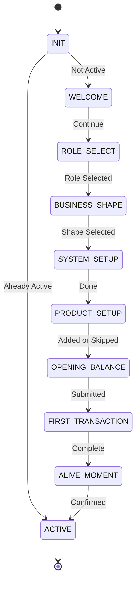

# Apple-Style ERP Onboarding: State Machine Specification

> This is the operational constitution of the onboarding process, not a diagram. It is designed to be directly translatable to XState, Redux state machine, or a backend workflow engine.

## 1. Core Concepts

### State Types

- **Transient**: System is working; user waits (no interaction).
- **Decision**: User makes a single decision.
- **Gate**: Validation checkpoint before proceeding.
- **Guided Action**: User performs a specific, multi-step task within a constrained UI.
- **System Feedback**: System displays results; user acknowledges.
- **Terminal**: Final state; onboarding ends.

### Gate Definitions

- **Hard Gate**: Cannot proceed without meeting conditions. System integrity depends on this.
- **Soft Gate**: Can be skipped. System remains consistent even if skipped.

## 2. High-Level State Diagram

## 3. Detailed State Specifications

### STATE: INIT

- **Type**: System Check
- **Entry Condition**: User authenticated, Company exists.
- **Transition**:
  - `if company.status != ACTIVE` → **WELCOME**
  - `else` → **ACTIVE** (Dashboard)

### STATE: WELCOME

- **Type**: Decision
- **Gate**: None
- **UI**: Single CTA "Continue".
- **Event**: `CONTINUE`
- **Transition**: **WELCOME** --`CONTINUE`--> **ROLE_SELECT**

### STATE: ROLE_SELECT

- **Type**: Decision
- **Gate**: **HARD**
- **Required Context**: `user.primary_role`
- **Event**: `SELECT_ROLE(role)`
- **Guard**: `role != null`
- **Side Effects**:
  - Persist role to user profile.
  - Preload role-based UI configuration.
- **Transition**: **ROLE_SELECT** --`SELECT_ROLE`--> **BUSINESS_SHAPE**

### STATE: BUSINESS_SHAPE

- **Type**: Decision
- **Gate**: **HARD**
- **Required Context**: `business.shape`
- **Event**: `SELECT_BUSINESS_SHAPE(shape)`
- **Guard**: `shape` in `[RETAIL, MANUFACTURING, SERVICE]`
- **Side Effects**:
  - Determine default Chart of Accounts (CoA).
  - Determine Inventory Logic.
  - Determine Costing Method (e.g., Average vs. FIFO).
- **Transition**: **BUSINESS_SHAPE** --> **SYSTEM_SETUP**

### STATE: SYSTEM_SETUP

- **Type**: Transient
- **Gate**: System (Internal)
- **UI**: "Setting things up..." (No user action).
- **Side Effects**:
  - Generate Chart of Accounts.
  - Set default accounting rules.
  - Enable minimal viable modules.
  - Disable approvals.
  - Initialize ledgers.
- **Transition**: `onDone` --> **PRODUCT_SETUP**

### STATE: PRODUCT_SETUP

- **Type**: Decision
- **Gate**: **SOFT**
- **Events**:
  - `ADD_PRODUCT(data)`
  - `SKIP`
- **Guards**: None.
- **Side Effects**:
  - `ADD_PRODUCT`: Create minimal product record.
  - `SKIP`: No operation.
- **Transition**: --> **OPENING_BALANCE**

### STATE: OPENING_BALANCE

- **Type**: Decision
- **Gate**: **HARD**
- **Required Context**: `cash_balance`, `bank_balance`
- **Event**: `SUBMIT_BALANCE(cash, bank)`
- **Guard**: `cash != null` AND `bank != null` (0 is valid).
- **Side Effects**:
  - Create Opening Balance Journal Entry.
  - Initialize Case & Bank Ledgers.
  - Validate balance integrity (e.g., non-negative if required).
- **Failure**: Stay in state (Inline validation).
- **Transition**: **OPENING_BALANCE** --> **FIRST_TRANSACTION**

### STATE: FIRST_TRANSACTION

- **Type**: Guided Action
- **Gate**: **HARD**
- **UI Rules**: Only one action enabled; Navigation restricted.
- **Events**: `CREATE_PURCHASE`, `RECEIVE_GOODS`
- **Guard**: `purchase_completed == true`
- **Side Effects**:
  - Create real Purchase Order.
  - Update Inventory Quantity.
  - Generate Accounting Journal.
  - **Lock transaction** (prevent edit to preserve history).
- **Transition**: **FIRST_TRANSACTION** --> **ALIVE_MOMENT**

### STATE: ALIVE_MOMENT

- **Type**: System Feedback
- **Gate**: None
- **UI**: Summary metrics; CTA "Start Using ERP".
- **Event**: `CONFIRM`
- **Transition**: **ALIVE_MOMENT** --> **ACTIVE**

### STATE: ACTIVE

- **Type**: Terminal
- **Side Effects**:
  - `company.status = ACTIVE`
  - Onboarding session closed.
  - Sidebar unlocked.
  - Tooltips switched to contextual only.

## 4. Hard Gate vs. Soft Gate Summary

| State                 | Gate | Reason                                                 |
| :-------------------- | :--- | :----------------------------------------------------- |
| **ROLE_SELECT**       | HARD | Determines UX & Security permissions.                  |
| **BUSINESS_SHAPE**    | HARD | Determines fundamental system behavior (CoA, Costing). |
| **PRODUCT_SETUP**     | SOFT | System can function with empty inventory.              |
| **OPENING_BALANCE**   | HARD | Essential for Accounting Integrity (Start point).      |
| **FIRST_TRANSACTION** | HARD | Proves system correctness & functionality to user.     |

## 5. Invariants (Must Always Hold)

> These are "Apple-level" laws. If any are violated, onboarding is considered failed.

1.  **No `ACTIVE` state without**:
    - A valid Opening Balance.
    - At least 1 Real Transaction.
2.  **No Transaction without a Journal Entry**.
3.  **No Journal without an Event**.
4.  **No Event without an Audit Trail**.

## 6. Why This is "Apple-Style"

- **Few States**: But explicit and decisive.
- **Strict Gates**: Only present where dangerous to proceed without.
- **Silent Work**: System Setup handles complexity invisibly.
- **Transparency**: User always knows _what_ is happening (system status), not _how_ (technical details).
