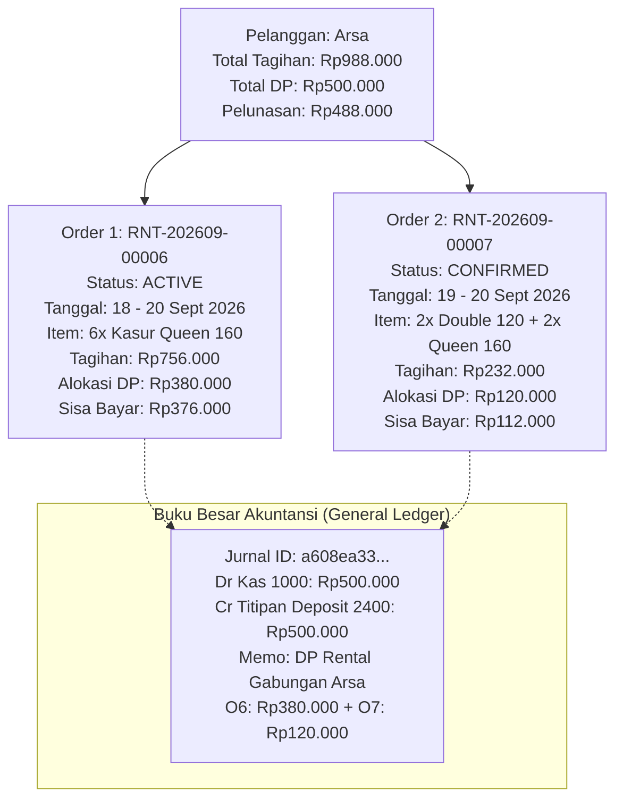

# 📋 Studi Kasus & Roadmap: Evaluasi Kendala Migrasi Google Sheets ke Sync ERP (Santi Living)

> **Dokumentasi Retrospektif Onboarding, Akar Masalah (Root Causes), dan Roadmap Pengembangan Fitur**  
> **Target Sistem**: Sync ERP (`@sync-erp/api`, `@sync-erp/web`, `@sync-erp/shared`)  
> **Studi Kasus**: Operasional Persewaan Santi Living  
> **Tanggal**: 18 September 2026  
> **Status**: Disetujui sebagai Dokumen Fondasi Pengembangan Selanjutnya  

---

## 1. Latar Belakang & Pernyataan Masalah (*Problem Statement*)

> *"Jujur, migrasi dari Sheets ke Sync ERP masih terasa sangat susah dan kaku..."*

Ungkapan di atas adalah umpan balik paling jujur dan esensial dari proses *onboarding* bisnis persewaan fisik (Santi Living) dari **Google Sheets** ke **Sync ERP**. 

Google Sheets selama bertahun-tahun telah menjadi "otak digital" operasional UMKM karena fleksibilitasnya yang tanpa batas:
* Admin bebas mengetik teks bebas di sel mana pun.
* Admin bebas menggabungkan (*merge*) sel baris pesanan, pembayaran, dan tanggal.
* Tidak ada validasi yang memblokir perubahan angka di masa lalu.

Namun, ketika data tersebut dialihkan ke **Sync ERP** yang mengadopsi fondasi **Sistem Akuntansi Buku Besar Ganda (*Double-Entry General Ledger*)** dan **Mesin Ketersediaan Inventaris Real-Time (*Real-Time Inventory Engine*)**, terjadi friksi operasional yang sangat nyata. Admin merasa sistem "kaku", "ribet", dan "sulit diedit".

Dokumen ini mencatat seluruh friksi tersebut secara objektif, menganalisis akar penyebabnya, dan menetapkan **Roadmap Fitur Baru** agar proses migrasi bisnis persewaan ke Sync ERP menjadi mulus dan intuitif.

---

## 2. 5 Kendala Utama yang Dihadapi Selama Proses Onboarding

```
┌───────────────────────────────────────────────────────────────────────────────────┐
│                    BENTURAN DUA PARADIGMA PENGELOLAAN DATA                        │
├─────────────────────────────────────────┬─────────────────────────────────────────┤
│       GOOGLE SHEETS (SPREADSHEET)       │           SYNC ERP (SISTEM ERP)         │
├─────────────────────────────────────────┼─────────────────────────────────────────┤
│ • Fleksibilitas tanpa aturan            │ • Integritas data & validasi ketat      │
│ • Merge sel sembarangan                 │ • Relasi database relasional (1:N, N:M) │
│ • Angka adalah catatan semata           │ • Setiap angka mengikat jurnal akuntansi│
│ • Tanggal hanya teks tanpa cek bentrok  │ • Tanggal mengunci fisik barang gudang  │
│ • Revisi data instan (timpa teks)       │ • Status ACTIVE mengunci perubahan form │
└─────────────────────────────────────────┴─────────────────────────────────────────┘
```

### Kendala 1: Perbedaan Pola Pikir Penguncian Form (*The Locked-Order Shock*)
* **Masalah Lapangan**: Admin mengeluhkan *"kenapa data yang sudah di-entry susah banget diedit?"*.
* **Akar Masalah**:
  * Di Sheets: Jika nominal salah, cukup klik sel dan ketik nominal baru.
  * Di ERP: Begitu pesanan dikonfirmasi (`status: CONFIRMED` atau `ACTIVE`), sistem langsung mengunci 24 unit fisik kasur/sprei dan menerbitkan jurnal kas masuk Rp500.000 (Dr Kas, Cr Liabilitas Deposit).
  * Sistem ERP secara arsitektural sengaja **memblokir edit langsung** untuk mencegah *fraud* (kecurangan kasir) dan kerusakan saldo buku besar. Namun bagi pengguna baru yang sedang memindahkan data migrasi, ini terasa seperti jalan buntu (*dead end*).

### Kendala 2: Dilema Uang Muka Historis / Saldo Awal (*Historical Opening Balance DP*)
* **Masalah Lapangan**: Seluruh pesanan di Google Sheets sudah dibayarkan DP-nya beberapa hari/minggu yang lalu dan uangnya sudah masuk ke rekening bank perusahaan (telah dicatat dalam saldo awal kas).
* **Akar Masalah**:
  * Pada alur konfirmasi standar (`confirmOrder`), Sync ERP selalu memanggil `JournalService.postRentalDeposit()`.
  * Akibatnya: Uang DP Rp500.000 tercatat dua kali di kas/bank—sekali saat pencatatan saldo awal, dan sekali lagi saat pesanan dikonfirmasi di layar rental.
* **Solusi Sementara yang Dibangun**:
  * Menambahkan parameter `accountingTreatment: 'OPENING_BALANCE_NO_POSTING'` pada schema validasi, sehingga pesanan tetap terkonfirmasi dan unit gudang teralokasi tanpa menduplikasi jurnal kas.

### Kendala 3: Pengantaran Bertahap tapi Pembayaran Gabungan (Kasus "Arsa")
* **Masalah Lapangan**: 
  * Pelanggan bernama Arsa menyewa barang untuk satu acara yang sama.
  * Namun pengantaran terpecah dua hari:
    * Gelombang 1 (18 Sept): 6 Kasur Queen 160.
    * Gelombang 2 (19 Sept): 2 Kasur Double 120 + 2 Kasur Queen 160.
    * Penarikan (20 Sept): Seluruh 10 kasur diambil bersamaan.
  * Admin Google Sheets menginput ini menjadi dua baris, lalu **menyatukan (*merge*)** kolom DP (Rp500.000) dan Total Harga (Rp988.000) di baris pertama, sedangkan baris kedua dibiarkan kosong harganya.
* **Akar Masalah di ERP**:
  * Model `RentalOrder` awal bersifat monolitik: satu pesanan hanya memiliki satu `rentalStartDate` dan satu `rentalEndDate`.
  * **Jika dipaksa 1 pesanan**: Kasur untuk gelombang 19 Sept akan terblokir sejak 18 Sept (*false overbooking*).
  * **Jika dipecah 2 pesanan (Opsi B)**: Pesanan 1 menampung seluruh tagihan Rp988.000 & DP Rp500.000, sedangkan Pesanan 2 berstatus Rp0 dan tidak memiliki catatan DP. Membagi angka secara proporsional setelah pesanan aktif menjadi sangat rumit.

### Kendala 4: Format Teks Bebas vs Normalisasi Item Bundle
* **Masalah Lapangan**: Kolom barang di Sheets berisi kalimat bebas:
  > *"paket Queen 160 = 6pcs. pasang seprai"*  
  > *"paket Queen 160 = 2pcs. paket Double 120 = 2pcs pasang seprai"*  
  > *"Air-cooler = 1pcs - motor zay"*
* **Akar Masalah**:
  * Sistem ERP membutuhkan ID produk terstruktur (`rentalItemId` atau `rentalBundleId`).
  * Admin harus mengurai manual: kasur tipe apa, berapa bantalnya, berapa spreinya, dan apakah ada biaya jasa tambahan (*add-on service* seperti pasang sprei Rp6.000/unit atau ongkos kirim motor/mobil).

### Kendala 5: Duplikasi Data Pelanggan (*Customer Entity Fragmentation*)
* **Masalah Lapangan**: Admin mengetik nama pelanggan di Sheets secara bervariasi:
  * Baris 239: `Arsa` (Nomor WA: `0877-3137-4962`)
  * Baris 240: `Arsa (t)` (Nomor WA: `0877-3137-4962`)
  * Contoh lain: `Dewi` dengan ejaan berbeda di berbagai tanggal.
* **Akar Masalah**: Script impor awal berisiko membuat entitas Partner baru untuk setiap variasi nama, padahal nomor WhatsApp dan orangnya sama persis.

---

## 3. Resolusi Kasus Nyata: Skenario Arsa (Opsi B)

Kasus Arsa telah berhasil diselesaikan secara transaksional di database Sync ERP dengan arsitektur proporsional:



### Hasil Rekonsiliasi Finansial:
1. **Nilai Tagihan**:
   * Order 1 (`RNT-00006`): Rp720.000 (Barang) + Rp36.000 (Pasang Seprai) = **Rp756.000**
   * Order 2 (`RNT-00007`): Rp220.000 (Barang) + Rp12.000 (Pasang Seprai) = **Rp232.000**
   * **Total: Rp988.000** *(100% Cocok dengan Google Sheets)*
2. **Alokasi DP & Pelunasan**:
   * Order 1: DP **Rp380.000** → Sisa Pelunasan **Rp376.000**
   * Order 2: DP **Rp120.000** → Sisa Pelunasan **Rp112.000**
   * **Total DP: Rp500.000** *(100% Cocok)*
   * **Total Pelunasan: Rp488.000** *(100% Cocok)*
3. **Alokasi Unit Gudang**:
   * Order 1 mengunci 24 unit fisik untuk tanggal 18–20 September.
   * Order 2 mengunci 16 unit fisik untuk tanggal 19–20 September (kasur gelombang kedua tidak diblokir pada tanggal 18 September).

---

## 4. Roadmap Fitur: Solusi Rekayasa untuk Pengembangan Masa Depan

Berdasarkan seluruh kesulitan yang dialami, berikut adalah **5 Fitur Utama** yang wajib dikembangkan di Sync ERP agar migrasi dari spreadsheet berikutnya menjadi otomatis dan tidak menyulitkan pengguna:

### 🚀 Fitur 1: Spreadsheet Migration Staging Wizard (Ruang Tunggu Impor)
* **Konsep**: Jangan langsung masukkan baris CSV ke tabel transaksi utama (`RentalOrder`). Sediakan tabel penampung sementara (*Staging Table*).
* **Alur Kerja**:
  1. Admin mengunggah file CSV / link Google Sheets.
  2. Data tampil dalam tabel interaktif di UI Sync ERP.
  3. Sistem memberikan visual warning: *"Baris 240 terdeteksi merge dengan Baris 239. Apakah ini pengantaran bertahap?"*.
  4. Admin dapat mengklik tombol **"Split Proporsional Otomatis"** atau **"Tautkan DP"** di layar preview sebelum data disahkan menjadi pesanan resmi.

### 🚀 Fitur 2: Multi-Milestone Delivery & Pickup (Split Pengantaran 1 Kontrak)
* **Konsep**: Satu `RentalOrder` memiliki relasi ke banyak `RentalFulfillmentGroup` / `RentalShipment`:
  ```prisma
  model RentalOrder {
    id           String
    orderNumber  String
    shipments    RentalShipment[] // Gelombang kirim
    // ...
  }

  model RentalShipment {
    id              String
    rentalOrderId   String
    type            ShipmentType // DELIVERY | PICKUP
    scheduledDate   DateTime
    timeWindow      String       // "pagi" | "sore"
    items           RentalShipmentItem[]
  }
  ```
* **Manfaat**: Kasus seperti Arsa tidak perlu dipecah menjadi dua `RentalOrder` terpisah. Tetap satu order dengan satu invoice dan satu deposit, tetapi jadwal gudang dan surat jalannya memiliki 2 gelombang pengiriman.

### 🚀 Fitur 3: Migration Correction Mode (Mode Koreksi Onboarding)
* **Konsep**: Selama masa *onboarding* (misal 14 hari pertama sejak company dibuat), berikan hak akses khusus kepada Admin/Owner untuk melakukan penyesuaian pesanan aktif:
  * Tombol **"Koreksi Alokasi Saldo Awal"** pada pesanan `ACTIVE` yang memiliki tag `MIGRATION_DATA`.
  * Sistem secara otomatis menerbitkan *Adjusting Journal Entry* (Jurnal Penyesuaian) di latar belakang tanpa mengharuskan admin membatalkan (*void*) pesanan.

### 🚀 Fitur 4: Shared / Group Customer Deposit
* **Konsep**: Mengizinkan satu transaksi `RentalDeposit` dialokasikan ke lebih dari satu pesanan (`1:N` allocation):
  ```prisma
  model RentalDepositAllocation {
    id              String
    rentalDepositId String
    rentalOrderId   String
    allocatedAmount Decimal
  }
  ```
* **Manfaat**: Jika pelanggan mentransfer DP Rp1.000.000 untuk 3 pesanan berbeda, kasir cukup menginput satu bukti transfer dan mencentang pesanan mana saja yang menerima porsi deposit tersebut.

### 🚀 Fitur 5: NLP / Regex Order Text Parser
* **Konsep**: Parser cerdas di antarmuka input cepat yang mampu menerjemahkan catatan khas admin persewaan:
  * Input: `"paket Queen 160 = 6pcs. pasang seprai"`
  * Output terdeteksi otomatis:
    * Bundle: `Queen (Paket 160)` — Qty: 6
    * Add-on Service: `Jasa Pasang Seprai` — Qty: 6 (@Rp6.000)

---

## 5. Ringkasan & Kesimpulan

Kesulitan yang dirasakan saat berpindah dari Google Sheets ke Sync ERP **bukanlah kegagalan pengguna**, melainkan **jurang alami antara fleksibilitas catatan bebas dan disiplin sistem akuntansi terpadu**.

Dengan:
1. Menyelesaikan kasus Arsa secara proporsional dan bersih hari ini,
2. Mengintegrasikan mode saldo awal tanpa jurnal kas ganda (`OPENING_BALANCE_NO_POSTING`), dan
3. Memasukkan 5 fitur perbaikan di atas ke dalam *product backlog*,

Sync ERP akan berevolusi dari sistem yang terasa "kaku" menjadi ERP persewaan paling adaptif yang mampu merangkul kebiasaan operasional UMKM tanpa mengorbankan integritas pembukuan dan stok gudang.
