# Sync ERP — SOP & Alur Real Operasional Rental Order Manual (Admin UI)

Dokumentasi ini disusun berdasarkan wawancara mendalam (*grill-me session*) mengenai alur operasional nyata di lapangan untuk **Rental Order Manual (Non-Website / WhatsApp / Direct Order)**.

---

## 1. Inti Kebijakan & Karakteristik Alur Riil

1. **Penguncian Order via DP (Down Payment ~30%)**:
   - Pembuatan pesanan awal berstatus **`DRAFT`** tanpa mengunci nomor seri fisik kasur.
   - Saat customer membayar uang muka (**DP ~30%**, fleksibel bisa lebih/kurang), Admin mengonfirmasi pesanan ➔ Status berubah menjadi **`CONFIRMED`** dan nomor unit fisik terkunci (**`RESERVED`**).
2. **Pelunasan di Titik Antar (COD / Transfer saat Armada Sampai)**:
   - Sisa pembayaran (70%) **tidak ditagih di muka**, melainkan saat armada kurir sudah tiba di lokasi customer (bisa Cash, QRIS, atau Transfer).
   - Driver melapor via WhatsApp ke Admin kantor (kirim foto serah terima/KTP + bukti transfer/cash).
   - Admin di kantor memverifikasi pelunasan lalu mengklik tombol **`Release Units (Serah Terima)`** ➔ Order berstatus **`ACTIVE`** dan unit berstatus **`RENTED`**.
3. **Fleksibilitas Extension: Full vs Partial Extension**:
   - **Full Extension**: Seluruh kasur diperpanjang durasinya. Customer bayar 100% biaya perpanjangan di muka.
   - **Partial Extension** *(Contoh: Sewa 3 kasur, di hari ke-2 ingin perpanjang 1 kasur saja)*:
     - UI menyediakan switcher: `[Full Extension | Partial Extension]`.
     - Saat *Partial Extension* dipilih, muncul tabel unit yang sedang disewa. Admin memilih spesifik unit yang diperpanjang.
     - **Armada Ekstra**: Terjadi trip logistik tambahan (Antar ➔ Jemput Sebagian ➔ Jemput Sisa).
     - Admin menginput **Ongkir Ekstra / Biaya Tambahan Armada** untuk penjemputan tambahan tersebut.
4. **Overdue / Penjemputan Tertunda**:
   - Jika saat jadwal penjemputan customer minta tunda atau kamar kos terkunci, **tidak dikenakan denda penalti**, melainkan langsung dikonversi menjadi **perpanjangan sewa harian** (admin buat extension harian + tagih biaya hari tersebut via WA).
5. **Kebijakan Jaminan & Kerusakan (Tanpa Deposit Tunai di Muka)**:
   - Bisnis **tidak menahan uang security deposit tunai** di muka (hanya DP 30% lalu pelunasan sewa 70% saat serah terima).
   - Jika saat penjemputan kasur kotor/rusak (noda ompol, tumpahan kopi, sobek, sundut rokok):
     - Biaya cuci/denda langsung ditagihkan di tempat oleh kurir atau via transfer WhatsApp.
     - Unit rusak masuk status **`MAINTENANCE`**.
     - Setelah semua unit fisik kembali, order berstatus **`COMPLETED`**.

---

## 2. Diagram Alur Operasional Riil (Mermaid)

```mermaid
flowchart TB
    %% ===================================================
    %% SYNC ERP - ALUR REAL RENTAL ORDER MANUAL ADMIN UI
    %% ===================================================

    subgraph Phase1["Fase 1: Pembuatan Draft Order (Inquiry / Booking)"]
        p1_start(("Mulai")) --> p1_menu["Admin Buka Menu:<br/><b>Rental Management</b> ➔ <b>Rental Orders</b>"]
        p1_menu --> p1_btn["Klik Tombol:<br/><b>+ Order Baru</b> (Kanan Atas)"]
        p1_btn --> p1_modal["Modal <b>CreateOrderModal</b> Terbuka"]
        p1_modal --> p1_cust["Pilih Customer (Dropdown Partner)"]
        p1_cust --> p1_check_cust{"Customer Sudah Ada?"}
        p1_check_cust -- Belum Ada --> p1_new_cust["Klik <b>+ Tambah Baru</b><br/>Modal <b>QuickCreateCustomerModal</b><br/>(Input Nama, No. WA, Alamat)"]
        p1_check_cust -- Sudah Ada --> p1_dates["Input Periode Sewa:<br/><b>Tanggal Mulai</b> & <b>Tanggal Selesai</b>"]
        p1_new_cust --> p1_dates
        p1_dates --> p1_items["Pilih Item Rental / Bundle & Qty<br/><i>(Sistem tampilkan sisa unit tersedia di gudang)</i>"]
        p1_items --> p1_ongkir["Input Ongkir Pengantaran & Diskon (jika ada)"]
        p1_ongkir --> p1_submit["Klik Tombol: <b>Buat Order</b>"]
        p1_submit --> p1_draft["State:<br/>• <b>Status Order: DRAFT</b><br/>• <b>Stok Belum Terkunci</b> (Belum Ada Serial Unit)"]
    end

    subgraph Phase2["Fase 2: Pembayaran DP & Penguncian Stok (Order Confirmation)"]
        p2_dp["Customer Transfer Down Payment (<b>DP ~30%</b> fleksibel)"]
        p2_dp --> p2_open["Admin Buka Detail Order (/rentals/orders/:id)"]
        p2_open --> p2_confirm_btn["Di RentalActionsCard, Klik: <b>Confirm Order</b>"]
        p2_confirm_btn --> p2_confirm_modal["Modal <b>ConfirmOrderModal</b> Terbuka"]
        p2_confirm_modal --> p2_stock_check{"Cek Stok Fisik Unit"}

        p2_stock_check -- Stok Cukup --> p2_happy_confirm["Klik Tombol Hijau:<br/><b>Konfirmasi Order</b>"]

        p2_stock_check -- Stok Kurang --> p2_fallback["Peringatan: <b>Unit Tidak Cukup</b>"]
        p2_fallback --> p2_convert["Opsi 1: Klik <b>Konversi Stok ke Unit Rental</b><br/>(Ubah stok dagang jadi unit rental)"]
        p2_fallback --> p2_manual_confirm["Opsi 2: Klik <b>Konfirmasi Manual</b><br/>(Centang <i>Lewati cek stok</i> + Catat Alasan)"]
        p2_convert --> p2_confirm_modal
        p2_manual_confirm --> p2_confirmed_state

        p2_happy_confirm --> p2_confirmed_state["State Transition Selesai:<br/>• <b>Status Order: CONFIRMED</b><br/>• Unit Serial Fisik Dialokasikan & Terkunci:<br/>  <b>Status Unit: RESERVED</b>"]
    end

    subgraph PhaseCancel["Opsi: Pembatalan Sebelum Kirim"]
        c_trigger["Customer Batal Sewa Sebelum Barang Dikirim"]
        c_trigger --> c_btn["Klik Tombol: <b>Cancel Order</b>"]
        c_btn --> c_modal["Modal <b>CancelOrderModal</b> (Wajib isi Alasan)"]
        c_modal --> c_done["State:<br/>• Unit RESERVED dilepas kembali jadi <b>AVAILABLE</b><br/>• Uang DP di-refund sesuai kebijakan<br/>• <b>Status Order: CANCELLED</b>"]
    end

    subgraph Phase3["Fase 3: Pengiriman, Pelunasan di Titik Antar & Handover"]
        p3_dispatch["Armada / Kurir Berangkat Mengantar Unit"]
        p3_dispatch --> p3_arrive["Armada Tiba di Titik Customer"]
        p3_arrive --> p3_pay["Customer Bayar <b>Pelunasan Sisa 70%</b><br/>(Pilihan: Cash / QRIS / Transfer saat armada di tempat)"]
        p3_pay --> p3_ktp["Driver Cek KTP Fisik & Ambil Foto Serah Terima Kasur"]
        p3_ktp --> p3_wa["Driver Lapor via WhatsApp ke Admin Kantor:<br/>Kirim Bukti Bayar Pelunasan + Foto Serah Terima/KTP"]
        p3_wa --> p3_admin_release["Admin Verifikasi Pelunasan di Kantor,<br/>Di RentalActionsCard Klik Tombol:<br/><b>Release Units (Serah Terima)</b> (Icon Truk)"]
        p3_admin_release --> p3_release_modal["Modal <b>UnitAssignmentModal</b> Terbuka"]
        p3_release_modal --> p3_upload_photo["Upload Foto Bukti Serah Terima<br/><i>(Atau centang 'Lewati cek foto' jika cepat)</i>"]
        p3_upload_photo --> p3_release_submit["Klik Tombol: <b>Serahkan Unit</b>"]
        p3_release_submit --> p3_active_state["State Transition Selesai:<br/>• <b>Status Order: ACTIVE</b> (Sewa Resmi Dimulai)<br/>• <b>Status Unit: RENTED</b>"]
    end

    subgraph Phase4["Fase 4: Masa Sewa & Logika Perpanjangan (Extension)"]
        p4_using["Customer Menggunakan Unit (Status: ACTIVE)"]
        p4_using --> p4_followup["Admin Follow-up WA (H-3 / H-1 Sebelum Jatuh Tempo)"]
        p4_followup --> p4_decision{"Keputusan Customer?"}

        %% Full Extension
        p4_decision -- Perpanjang Semua Unit --> p4_full_ext["Pilih: <b>Full Extension</b><br/>Perpanjang seluruh unit N hari"]
        p4_full_ext --> p4_pay_ext["Customer Bayar 100% Biaya Extension di Muka"]
        p4_pay_ext --> p4_update_order["Update Order: rentalEndDate & dueDateTime Mundur<br/>Status Tetap <b>ACTIVE</b>"]
        p4_update_order --> p4_using

        %% Partial Extension
        p4_decision -- Perpanjang Sebagian Unit Saja --> p4_part_switch["Pilih Switcher: <b>Partial Extension</b>"]
        p4_part_switch --> p4_part_table["Tampil Tabel Unit yang Sedang Disewa"]
        p4_part_table --> p4_part_select["Admin Centang Unit yang Mau Diperpanjang<br><i>(Unit yang tidak dicentang dijadwalkan dijemput sesuai tanggal awal)</i>"]
        p4_part_select --> p4_part_ongkir["Input: <b>Ongkir Ekstra / Biaya Tambahan Armada</b><br><i>(Untuk cover trip penjemputan terpisah)</i>"]
        p4_part_ongkir --> p4_pay_ext

        %% Overdue / Tunda Jemput
        p4_decision -- Minta Tunda / Kos Terkunci --> p4_overdue["Jadwal Jemput Tertunda (Overdue)"]
        p4_overdue --> p4_auto_ext["<b>SOP: Dianggap Sewa Harian</b><br>Admin buatkan extension harian & tagih via WA"]
        p4_auto_ext --> p4_pay_ext

        %% Selesai Sewa
        p4_decision -- Selesai Sesuai Jadwal --> p4_pickup["Jadwalkan Penjemputan Armada"]
    end

    subgraph Phase5["Fase 5: Penjemputan, Inspeksi Fisik & Penutupan Order"]
        p5_arrive["Armada Tiba Menjemput Unit"]
        p5_arrive --> p5_inspect{"Driver Inspeksi Fisik Barang di Tempat"}

        %% Kondisi Bagus
        p5_inspect -- Bersih & Kondisi Bagus --> p5_good["Barang Diangkut Balik ke Gudang"]

        %% Kondisi Rusak / Noda
        p5_inspect -- Ada Noda / Sobek / Rusak --> p5_damaged["Ada Kerusakan / Noda Ompol / Sundut Rokok"]
        p5_damaged --> p5_charge_damage["<b>Tagih Biaya Cuci / Denda Langsung</b><br/>Customer bayar di tempat (Cash/Transfer)<br/><i>(Karena tidak ada uang deposit di muka)</i>"]
        p5_charge_damage --> p5_good

        p5_good --> p5_admin_return["Admin Buka Order ➔ Klik Tombol:<br/><b>Return Units (Kembalikan)</b>"]
        p5_admin_return --> p5_modal_return["Modal <b>ReturnModal</b> Terbuka"]
        p5_modal_return --> p5_fill_return["Input Tanggal Kembali Aktual,<br/>Pilih Kondisi Unit, Catat Kerusakan & Upload Foto Akhir"]
        p5_fill_return --> p5_process_return["Klik Tombol: <b>Proses Return</b>"]

        p5_process_return --> p5_unit_status["Update Status Unit Fisik:<br/>• Unit Bagus ➔ <b>AVAILABLE</b> (Siap disewa lagi)<br/>• Unit Rusak/Kotor ➔ <b>MAINTENANCE</b> (Cuci/Reparasi)"]
        p5_unit_status --> p5_completed_state["State Transition Selesai:<br/>• <b>Status Order: COMPLETED</b> (Order Resmi Selesai & Ditutup)"]
        p5_completed_state --> p5_end(("Selesai"))
    end

    %% Flow Connections
    p1_draft --> p2_dp
    p2_confirmed_state --> p3_dispatch
    p2_confirmed_state -. Jika Batal Sebelum Dikirim .-> c_trigger
    p1_draft -. Jika Batal .-> c_trigger
    p3_active_state --> p4_using
    p4_pickup --> p5_arrive

    %% Styling Classes
    classDef stepHeader fill:#e3f2fd,stroke:#1565c0,stroke-width:2px,color:#0d47a1;
    classDef uiAction fill:#fff9c4,stroke:#fbc02d,stroke-width:2px,color:#f57f17;
    classDef waAction fill:#c8e6c9,stroke:#2e7d32,stroke-width:2px,color:#1b5e20;
    classDef stateDone fill:#d1c4e9,stroke:#512da8,stroke-width:2px,color:#311b92;
    classDef warnNode fill:#ffe0b2,stroke:#e65100,stroke-width:2px,color:#bf360c;
    classDef dangerNode fill:#ffebee,stroke:#c62828,stroke-width:2px,color:#b71c1c;

    class p1_btn,p1_modal,p1_cust,p1_new_cust,p1_dates,p1_items,p1_ongkir,p1_submit,p2_open,p2_confirm_btn,p2_happy_confirm,p2_convert,p2_manual_confirm,p3_admin_release,p3_release_submit,p4_full_ext,p4_part_switch,p4_part_select,p4_part_ongkir,p5_admin_return,p5_process_return uiAction;
    class p2_dp,p3_pay,p3_wa,p4_followup,p4_pay_ext,p5_charge_damage waAction;
    class p1_draft,p2_confirmed_state,p3_active_state,p4_update_order,p5_unit_status,p5_completed_state stateDone;
    class p2_fallback,p4_overdue,p5_damaged warnNode;
    class c_trigger,c_btn,c_done dangerNode;
    class p1_start,p5_end stepHeader;
```

---

## 3. Matriks Operasional UI Lengkap (Step-by-Step Experience)

### Tahap 1: Pembuatan Pesanan Manual (`DRAFT`)
- **Tujuan**: Mencatat kebutuhan booking customer tanpa mengunci fisik unit kasur.
- **Navigasi**: Menu `Rental Management` ➔ `Rental Orders` (`/rentals/orders`).
- **Aksi Tombol**: Klik tombol **`+ Order Baru`** di pojok kanan atas.
- **Modal**: `CreateOrderModal`.

| Field / Komponen | Tindakan Admin | Logika Sistem / Fallback |
| :--- | :--- | :--- |
| **Customer** | Pilih dari dropdown partner | Jika customer baru, klik **`+ Tambah Baru`** ➔ Muncul modal cepat `QuickCreateCustomerModal` (Nama, WhatsApp, Alamat). Simpan langsung terpilih tanpa menutup order. |
| **Tanggal Mulai & Selesai** | Input date picker | Sistem menghitung durasi sewa dalam hari (`rentalDays`). |
| **Item Rental** | Pilih kasur/bantal/sprei & Qty | Sistem menampilkan stok unit gudang yang tersedia. Tarif tier dihitung otomatis. |
| **Biaya Ongkir** | Input nominal ongkir pengantaran | Ditambahkan ke grand total. |
| **Submit** | Klik **`Buat Order`** | Order tersimpan dengan status **`DRAFT`**. Unit fisik **belum terkunci**. |

---

### Tahap 2: Penerimaan DP & Konfirmasi Order (`CONFIRMED`)
- **Tujuan**: Mengunci unit kasur setelah customer membayar uang muka (**DP ~30%**).
- **Navigasi**: Buka detail order (`/rentals/orders/:id`).
- **Aksi Tombol**: Di sidebar kanan (*RentalActionsCard*), klik tombol hijau **`Confirm Order`**.
- **Modal**: `ConfirmOrderModal`.

#### Logika Pengecekan Stok & Fallback:
1. **Happy Path (Stok Cukup)**:
   - Tampil kotak biru auto-assign.
   - Admin klik tombol hijau **`Konfirmasi Order`**.
   - Sistem memilihkan serial unit secara otomatis. Unit berubah jadi **`RESERVED`**. Order menjadi **`CONFIRMED`**.
2. **Fallback 1 (Stok Unit Kurang)**:
   - Peringatan merah: *Unit Tidak Cukup*.
   - Admin klik **`Konversi Stok ke Unit Rental`** (Modal `QuickAddUnitsModal`) untuk mengubah stok barang baru gudang menjadi unit rental bernomor seri.
3. **Fallback 2 (Bypass Manual / Catatan Khusus)**:
   - Admin klik **`Konfirmasi Manual`**.
   - Masukkan metode bayar DP, jumlah DP yang masuk, centang `Lewati cek stok`, dan isi catatan alasan konfirmasi.
   - Klik **`Konfirmasi Manual`** ➔ Order menjadi **`CONFIRMED`**.

---

### Tahap 3: Serah Terima di Lokasi & Pelunasan 70% (`ACTIVE`)
- **Tujuan**: Menyerahkan barang dan mengaktifkan masa sewa setelah customer melunasi sisa sewa saat armada tiba.
- **SOP Lapangan**:
  1. Armada tiba di kos/rumah customer.
  2. Customer membayar sisa 70% (Cash ke kurir, scan QRIS, atau transfer bank).
  3. Driver mencocokkan KTP fisik dan mengambil foto serah terima barang di kamar.
  4. Driver mengirimkan bukti bayar + foto serah terima ke Admin kantor via WhatsApp.
- **Aksi Admin di UI**:
  1. Buka detail order di Sync ERP.
  2. Di *RentalActionsCard*, klik tombol **`Release Units (Serah Terima)`** (ikon truk).
  3. Modal `UnitAssignmentModal` terbuka.
  4. Upload foto bukti dari kurir (atau centang `Lewati cek foto` jika cepat).
  5. Klik tombol **`Serahkan Unit`**.
- **State Transition**:
  - Status Order: `CONFIRMED` ➔ **`ACTIVE`**.
  - Status Unit: `RESERVED` ➔ **`RENTED`**.

---

### Tahap 4: Masa Sewa & Logika Perpanjangan (Extension)
Saat mendekati waktu selesai (H-3 atau H-1), Admin follow-up customer via WhatsApp:

#### Skenario 1: Full Extension (Perpanjang Semua)
- Customer memperpanjang seluruh unit yang disewa untuk $N$ hari ke depan.
- Customer membayar 100% biaya perpanjangan di muka.
- Admin input extension di tab *Rental Extensions*:
  - Pilih tanggal selesai baru.
  - Tanggal `rentalEndDate` dan `dueDateTime` otomatis mundur.
  - Status order **tetap `ACTIVE`**.

#### Skenario 2: Partial Extension (Perpanjang Sebagian Unit)
*Contoh Kasus: Customer menyewa 3 kasur selama 3 hari. Di hari ke-2, customer hanya ingin memperpanjang 1 kasur selama 1 hari lagi.*
- **Dampak Logistik**: Terjadi 3 trip armada:
  1. Pengantaran (3 kasur) — *Trip 1*
  2. Penjemputan sebagian (2 kasur di hari ke-3) — *Trip 2 (Ekstra)*
  3. Penjemputan sisa (1 kasur di hari ke-4) — *Trip 3*
- **Aksi Admin di UI Extension**:
  1. Pilih Switcher: **`Partial Extension`**.
  2. Tampil tabel unit yang sedang disewa.
  3. Admin mencentang kasur mana saja yang diperpanjang dan menentukan tanggal baru untuk unit tersebut.
  4. Unit yang **tidak dicentang** tetap terjadwal untuk dijemput pada tanggal awal.
  5. Admin menginput nominal pada field: **`Biaya Tambahan Armada / Ongkir Ekstra`** untuk menutupi biaya bensin/kurir trip penjemputan tambahan.
  6. Customer melunasi biaya perpanjangan + ongkir ekstra di muka.

#### Skenario 3: Overdue / Gagal Jemput (Tunda Waktu)
- Jika saat armada datang penjemputan customer tidak bisa dihubungi atau kos terkunci:
- **SOP**: Langsung dikonversi menjadi **sewa harian tambahan**.
- Admin membuatkan perpanjangan 1 hari dan menagihkan biaya hari tersebut ke customer via WhatsApp.

---

### Tahap 5: Pengembalian, Cek Fisik & Penutupan Order (`COMPLETED`)
- **Tujuan**: Menerima unit kembali, menyelesaikan denda (bila ada), dan menutup pesanan.
- **SOP Lapangan**:
  1. Armada tiba menjemput kasur.
  2. Driver menginspeksi fisik kasur: noda ompol/kotoran, kain sobek, sundut rokok, kelengkapan bantal/sprei.
  3. **Penanganan Kerusakan/Noda**:
     - Karena **tidak ada deposit uang tunai di muka**, kurir/admin **langsung menagihkan biaya cuci/denda kerusakan di tempat** kepada customer (Cash atau Transfer WhatsApp).
- **Aksi Admin di UI**:
  1. Buka detail order ➔ klik tombol **`Return Units (Kembalikan)`** di *RentalActionsCard*.
  2. Modal `ReturnModal` terbuka:
     - Input *Tanggal & Jam Pengembalian Aktual*.
     - Pilih *Kondisi Unit* (`GOOD`, `FAIR`, `NEEDS_REPAIR`).
     - Jika ada noda/rusak: pilih tingkat kerusakan (`MINOR`, `MAJOR`, `UNUSABLE`) dan input catatan kerusakan.
     - Upload foto kondisi akhir barang.
  3. Klik tombol **`Proses Return`**.
- **State Transition Akhir**:
  - Unit yang berkondisi baik ➔ Berstatus **`AVAILABLE`** (langsung bisa disewakan ke orang lain).
  - Unit yang kotor/butuh perbaikan ➔ Berstatus **`MAINTENANCE`** (dikunci dari sistem hingga selesai dicuci/diperbaiki).
  - Status Order: `ACTIVE` ➔ **`COMPLETED`** (*Order resmi ditutup*).
