# Sync ERP — Rental Order End-to-End Flow

Dokumentasi lengkap alur siklus hidup (lifecycle) **Rental Order** di Sync ERP, mulai dari inisiasi pesanan, verifikasi pembayaran deposit, alokasi unit fisik, pengiriman & inspeksi serah terima, masa sewa & perpanjangan (extension), hingga pengembalian, kalkulasi denda, settlement deposit, dan penutupan order.

File visual diagram murni & panduan detail:
- [rental-order-flow.mermaid](file:///Users/wecik/Documents/Offline/Professional/Coding/sync-erp/docs/flows/rental-order-flow.mermaid)
- [docs/rental-order-flow.mermaid](file:///Users/wecik/Documents/Offline/Professional/Coding/sync-erp/docs/rental-order-flow.mermaid)
- [admin-manual-rental-order-guide.md](file:///Users/wecik/Documents/Offline/Professional/Coding/sync-erp/docs/flows/admin-manual-rental-order-guide.md) *(Panduan Operasional Lengkap Admin UI, Tombol, If-Else & Fallback)*

---

## 1. Visual Flowchart (Mermaid)

```mermaid
flowchart TB
    %% ==========================================
    %% SYNC ERP - REAL RENTAL ORDER LIFECYCLE FLOW
    %% ==========================================

    subgraph Phase1["Phase 1: Order Initiation & Booking (Status: DRAFT)"]
        Start(("Mulai"))
        n1["Channel Pemesanan:<br/>1. Admin ERP Manual Entry (WhatsApp / Call / Walk-in)<br/>2. Storefront Website (Santi Living)"]
        n2["Input Data Customer:<br/>Pilih Partner Customer atau Tambah Cepat (Quick Create)"]
        n3["Pilih Rental Item / Bundle & Durasi Sewa<br/>(Tanggal Mulai, Tanggal Selesai)"]
        n4["Kalkulasi Otomatis Pricing Tier & Ongkir:<br/>- Tarif Harian / Mingguan / Bulanan Termurah<br/>- Ongkos Kirim Armada Pengantaran"]
        n5["Simpan Rental Order di Sync ERP<br/>Status: DRAFT | Stok Belum Dikunci"]
    end

    subgraph Phase2["Phase 2: Pembayaran DP & Penguncian Stok (Status: CONFIRMED)"]
        n6["Customer Bayar Uang Muka (DP ~30% Fleksibel)"]
        n7["Admin Verifikasi Pembayaran DP (Transfer / QRIS / Cash)"]
        n8["Admin Klik Tombol: <b>Confirm Order</b>"]
        n9{"Cek Ketersediaan Fisik Unit (RentalItemUnit)"}
        n10["Stok Cukup: Sistem Auto-Assign Nomor Seri Unit"]
        n11["Stok Kurang: Admin Konversi Stok Baru atau Konfirmasi Manual Bypass"]
        n12["State Transition:<br/>- Status Order: <b>CONFIRMED</b> (confirmedAt)<br/>- Unit Fisik Terkunci: <b>RESERVED</b>"]
    end

    subgraph Phase3["Phase 3: Pengiriman & Pelunasan di Titik Antar (Status: ACTIVE)"]
        n13["Armada / Kurir Berangkat Antar Kasur"]
        n14["Armada Tiba di Lokasi Customer"]
        n15["Customer Bayar <b>Pelunasan Sisa 70%</b><br/>(Cash ke Kurir / QRIS / Transfer Bank)"]
        n16["Driver Cek KTP Fisik & Ambil Foto Serah Terima"]
        n17["Driver Lapor via WhatsApp ke Admin Kantor:<br/>Kirim Bukti Bayar Pelunasan + Foto Serah Terima/KTP"]
        n18["Admin di Kantor Klik Tombol:<br/><b>Release Units (Serah Terima)</b> (Icon Truk)"]
        n19["State Transition:<br/>- Status Order: <b>ACTIVE</b> (Sewa Dimulai)<br/>- Status Unit: <b>RENTED</b>"]
    end

    subgraph Phase4["Phase 4: Masa Sewa Berjalan & Logika Extension"]
        n20["Customer Menggunakan Unit (Status: ACTIVE)"]
        n21["Admin Follow-up WA H-3 / H-1 Sebelum Jatuh Tempo"]
        n22{"Keputusan Customer?"}

        %% Full Extension
        n23["Pilihan: <b>Full Extension</b><br/>Perpanjang seluruh unit N hari"]
        n24["Customer Bayar 100% Biaya Extension di Muka"]
        n25["Update Order: rentalEndDate Mundur<br/>Status Tetap <b>ACTIVE</b>"]

        %% Partial Extension
        n26["Pilihan Switcher: <b>Partial Extension</b>"]
        n27["Tabel Unit Tampil: Admin Centang Unit yang Diperpanjang"]
        n28["Input: <b>Ongkir Ekstra / Biaya Tambahan Armada</b><br/>(Cover trip penjemputan sebagian + sisa)"]

        %% Overdue / Tunda Jemput
        n29["Jadwal Jemput Tertunda (Kamar Terkunci / Minta Tunda)"]
        n30["<b>SOP: Dianggap Sewa Harian</b><br/>Admin buat extension harian & tagih via WA"]

        %% Selesai Sesuai Jadwal
        n31["Customer Konfirmasi Selesai Sesuai Jadwal"]
    end

    subgraph Phase5["Phase 5: Penjemputan, Cek Fisik & Closing (Status: COMPLETED)"]
        n32["Armada Tiba Menjemput Unit"]
        n33{"Driver Cek Kondisi Fisik di Lokasi"}
        n34["Kondisi Bersih & Normal: Barang Diangkut ke Gudang"]
        n35["Ada Kerusakan / Noda Ompol / Sundut Rokok"]
        n36["<b>Tagih Biaya Cuci / Denda Langsung</b><br/>(Customer bayar di tempat via cash/transfer)"]
        n37["Admin Klik Tombol: <b>Return Units (Kembalikan)</b>"]
        n38["Modal Return: Input Waktu Aktual, Catat Kerusakan & Upload Foto Akhir"]
        n39["Update Status Fisik Unit:<br/>- Unit Bagus: <b>AVAILABLE</b> (Siap disewa lagi)<br/>- Unit Rusak/Kotor: <b>MAINTENANCE</b> (Cuci/Reparasi)"]
        n40["Closing Order:<br/><b>Status Order: COMPLETED</b> (Order Ditutup Sempurna)"]
        OrderEnd(("Order Selesai"))
    end

    subgraph PhaseCancel["Phase Alternatif: Pembatalan Sebelum Kirim (Status: CANCELLED)"]
        n41["Customer Batal Sebelum Barang Dikirim"]
        n42["Admin Klik Tombol: <b>Cancel Order</b> (Wajib isi alasan)"]
        n43["Unit RESERVED Dilepas Kembali Jadi <b>AVAILABLE</b>"]
        n44["Refund Uang DP Sesuai Kebijakan"]
        n45["Status Order: <b>CANCELLED</b>"]
        CancelEnd(("Order Dibatalkan"))
    end

    %% Connections
    Start --> n1
    n1 --> n2
    n2 --> n3
    n3 --> n4
    n4 --> n5
    n5 --> n6
    n6 --> n7
    n7 --> n8
    n8 --> n9
    n9 -- Cukup --> n10
    n9 -- Kurang --> n11
    n10 --> n12
    n11 --> n12

    %% Cancellation
    n5 -. Batal .-> n41
    n12 -. Batal Sebelum Kirim .-> n41
    n41 --> n42
    n42 --> n43
    n43 --> n44
    n44 --> n45
    n45 --> CancelEnd

    %% Handover
    n12 --> n13
    n13 --> n14
    n14 --> n15
    n15 --> n16
    n16 --> n17
    n17 --> n18
    n18 --> n19

    %% In Use & Extension
    n19 --> n20
    n20 --> n21
    n21 --> n22

    n22 -- Perpanjang Semua --> n23
    n23 --> n24
    n24 --> n25
    n25 --> n20

    n22 -- Perpanjang Sebagian --> n26
    n26 --> n27
    n27 --> n28
    n28 --> n24

    n22 -- Minta Tunda / Gagal Jemput --> n29
    n29 --> n30
    n30 --> n24

    n22 -- Selesai Sesuai Jadwal --> n31
    n31 --> n32

    %% Return
    n32 --> n33
    n33 -- Bersih & Aman --> n34
    n33 -- Kotor / Rusak --> n35
    n35 --> n36
    n36 --> n34
    n34 --> n37
    n37 --> n38
    n38 --> n39
    n39 --> n40
    n40 --> OrderEnd

    %% Class Definitions
    classDef clientWeb fill:#bbdefb,stroke:#1565c0,stroke-width:2px,color:#0d47a1;
    classDef syncWeb fill:#fff9c4,stroke:#fbc02d,stroke-width:2px,color:#f57f17;
    classDef syncApi fill:#e1bee7,stroke:#6a1b9a,stroke-width:2px,color:#4a148c;
    classDef botWa fill:#c8e6c9,stroke:#2e7d32,stroke-width:2px,color:#1b5e20;
    classDef stateNode fill:#cfd8dc,stroke:#455a64,stroke-width:2px,color:#263238;
    classDef successNode fill:#d1c4e9,stroke:#512da8,stroke-width:2px,color:#311b92;
    classDef alertNode fill:#ffe0b2,stroke:#e65100,stroke-width:2px,color:#bf360c;
    classDef errorNode fill:#ffebee,stroke:#c62828,stroke-width:2px,color:#b71c1c;

    class n2,n3,n4,n8,n18,n23,n26,n27,n28,n37,n38,n42 syncWeb;
    class n6,n15,n16,n17,n21,n24,n36 botWa;
    class n5,n12,n19,n25,n39,n40,n45 stateNode;
    class n10,n11,n13,n14,n32,n34,n43,n44 syncApi;
    class n29,n30,n35 alertNode;
    class n41 errorNode;
    class Start,OrderEnd,CancelEnd successNode;
```



---

## 2. State Machine: `RentalOrderStatus`

```
           ┌──────────────────────────────────────────────┐
           │                                              ▼
       [ DRAFT ] ──(Confirm Order)──► [ CONFIRMED ] ──(Release Order)──► [ ACTIVE ]
           │                               │                               │
           │                               │                               │
           ▼                               ▼                               ▼
     (Cancel Order)                  (Cancel Order)                  (Process Return)
           │                               │                               │
           └───────────────┬───────────────┘                               ▼
                           ▼                                         [ COMPLETED ]
                     [ CANCELLED ]
```

| State | Keterangan | Valid Transitions Menuju State Berikutnya |
| :--- | :--- | :--- |
| **`DRAFT`** | Order dibuat, rincian biaya & kebijakan dihitung, menunggu pembayaran deposit. | `CONFIRMED`, `CANCELLED` |
| **`CONFIRMED`** | Pembayaran deposit terverifikasi, unit serial fisik dialokasikan (`RESERVED`). Siap kirim. | `ACTIVE`, `CANCELLED` |
| **`ACTIVE`** | Barang telah diserahterimakan ke customer, kondisi awal terdokumentasi, sewa berjalan. | `COMPLETED` |
| **`COMPLETED`** | Barang telah dikembalikan, diinspeksi, denda/kerusakan diselesaikan dari deposit, order ditutup. | *(Terminal State)* |
| **`CANCELLED`** | Order dibatalkan sebelum rilis unit. Unit dilepas kembali ke `AVAILABLE`, deposit di-refund. | *(Terminal State)* |

---

## 3. Sub-State: `RentalPaymentStatus`

| Payment Status | Kondisi | Aksi Selanjutnya |
| :--- | :--- | :--- |
| **`PENDING`** | Order baru dibuat, menunggu transfer / scan QRIS. | Customer kirim bukti bayar atau klik "Sudah Bayar" |
| **`AWAITING_CONFIRM`** | Customer mengklaim pembayaran (`paymentClaimedAt`). | Admin verifikasi mutasi bank / webhook QRIS |
| **`CONFIRMED`** | Pembayaran berhasil diverifikasi admin / gateway (`paymentConfirmedAt`). Deposit masuk status `HELD`. | Lanjut ke konfirmasi order & assign unit |
| **`FAILED`** | Pembayaran ditolak karena mutasi tidak ditemukan, kadaluarsa, atau nominal salah. | Customer diminta transfer ulang atau upload bukti |

---

## 4. Lifecycle Unit Fisik (`RentalItemUnit`)

| Status Unit | Terjadi Saat |
| :--- | :--- |
| **`AVAILABLE`** | Unit berada di gudang, siap disewakan. |
| **`RESERVED`** | Unit dialokasikan ke order tertentu (`RentalOrderUnitAssignment`) saat order status `CONFIRMED`. |
| **`RENTED`** | Unit telah diserahterimakan dan keluar dari gudang (order status `ACTIVE`). |
| **`MAINTENANCE`** | Unit dikembalikan dalam keadaan rusak/kotor dan membutuhkan perbaikan/laundry sebelum bisa disewakan kembali. |
| **`RETIRED`** | Unit sudah rusak total, hilang, atau melewati umur ekonomis. |

---

## 5. Layanan & File Terkait di Codebase

- **Data Models**: [schema.prisma](file:///Users/wecik/Documents/Offline/Professional/Coding/sync-erp/packages/database/prisma/schema.prisma) (`RentalOrder`, `RentalOrderItem`, `RentalItemUnit`, `RentalOrderUnitAssignment`, `RentalDeposit`, `RentalReturn`, `RentalOrderExtension`)
- **Lifecycle & Policies**: [rental.policy.ts](file:///Users/wecik/Documents/Offline/Professional/Coding/sync-erp/apps/api/src/modules/rental/rental.policy.ts)
- **Fulfillment & Confirmation**: [rental-order-fulfillment.service.ts](file:///Users/wecik/Documents/Offline/Professional/Coding/sync-erp/apps/api/src/modules/rental/rental-order-fulfillment.service.ts)
- **Payment & Verification**: [rental-order-payment.service.ts](file:///Users/wecik/Documents/Offline/Professional/Coding/sync-erp/apps/api/src/modules/rental/rental-order-payment.service.ts)
- **Return & Settlement**: [rental-return.service.ts](file:///Users/wecik/Documents/Offline/Professional/Coding/sync-erp/apps/api/src/modules/rental/rental-return.service.ts)
