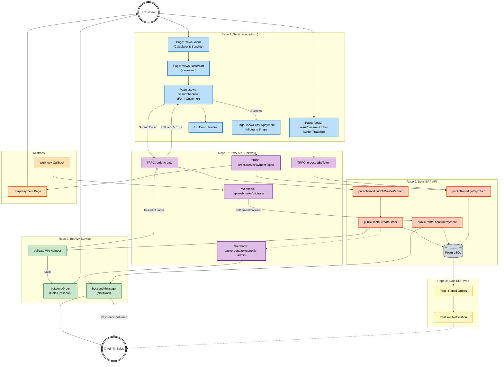

```mermaid
flowchart TB
    %% --- DEFINISI STYLE/KELAS ---
    classDef human stroke:#000000, fill:#ffffff, stroke-width:2px
    classDef clientWeb fill:#bbdefb, stroke:#1565c0, stroke-width:2px, color:#000000
    classDef proxyApi fill:#e1bee7, stroke:#6a1b9a, stroke-width:2px, color:#000000
    classDef syncApi fill:#ffccbc, stroke:#d84315, stroke-width:2px, color:#000000
    classDef syncWeb fill:#fff9c4, stroke:#fbc02d, stroke-width:2px, color:#000000
    classDef botWa fill:#c8e6c9, stroke:#2e7d32, stroke-width:2px, color:#000000
    classDef payment fill:#ffe0b2, stroke:#e65100, stroke-width:2px, color:#000000
    classDef database fill:#cfd8dc, stroke:#455a64, stroke-width:2px, shape:cylinder, color:#000000

    %% --- ACTORS ---
    Cust((("👤 Customer"))):::human
    Adm((("👤 Admin Sales"))):::human

    %% --- FRONTEND (Santi Living Web) ---
    subgraph Frontend["Repo 1: Santi Living (Astro)"]
        UI_Calc["Page: /sewa-kasur<br>(Calculator & Bundles)"]:::clientWeb
        UI_Cart["Page: /sewa-kasur/cart<br>(Keranjang)"]:::clientWeb
        UI_Checkout["Page: /sewa-kasur/checkout<br>(Form Customer)"]:::clientWeb
        UI_Payment["Page: /sewa-kasur/payment<br>(Midtrans Snap)"]:::clientWeb
        UI_Track["Page: /sewa-kasur/pesanan/:token<br>(Order Tracking)"]:::clientWeb
        UI_Err["UI: Error Handler"]:::clientWeb
    end

    %% --- PROXY API (Railway) ---
    subgraph Proxy["Repo 1: Proxy API (Railway)"]
        P_OrderCreate["TRPC: order.create"]:::proxyApi
        P_OrderGet["TRPC: order.getByToken"]:::proxyApi
        P_PayToken["TRPC: order.createPaymentToken"]:::proxyApi
        P_MidWH["Webhook: /api/webhooks/midtrans"]:::proxyApi
        P_NotifyWH["Webhook: /api/orders/:token/notify-admin"]:::proxyApi
    end

    %% --- CORE ERP (Sync ERP) ---
    subgraph CoreSystem["Repo 2: Sync ERP API"]
        API_Partner["publicRental.findOrCreatePartner"]:::syncApi
        API_Create["publicRental.createOrder"]:::syncApi
        API_Get["publicRental.getByToken"]:::syncApi
        API_Confirm["publicRental.confirmPayment"]:::syncApi
        DB[("PostgreSQL")]:::database
    end

    %% --- BOT SERVICE ---
    subgraph Bot["Repo 2: Bot WA Service"]
        Bot_Send["bot.sendOrder<br>(Detail Pesanan)"]:::botWa
        Bot_Msg["bot.sendMessage<br>(Notifikasi)"]:::botWa
        Bot_Validate["Validate WA Number"]:::botWa
    end

    %% --- PAYMENT ---
    subgraph Payment["Midtrans"]
        MT_Snap["Snap Payment Page"]:::payment
        MT_WH["Webhook Callback"]:::payment
    end

    %% --- ADMIN DASHBOARD ---
    subgraph AdminDash["Repo 2: Sync ERP Web"]
        Dash_List["Page: Rental Orders"]:::syncWeb
        Dash_Notif["Realtime Notification"]:::syncWeb
    end

    %% ========================================
    %% FLOW 1: BROWSING & ORDER CREATION
    %% ========================================

    Cust --> UI_Calc
    UI_Calc --> UI_Cart
    UI_Cart --> UI_Checkout
    UI_Checkout -- "Submit Order" --> P_OrderCreate

    %% Proxy to ERP
    P_OrderCreate --> API_Partner
    API_Partner --> API_Create
    API_Create --> DB

    %% WA Validation Flow
    API_Create --> Bot_Validate
    Bot_Validate -- "Valid" --> Bot_Send
    Bot_Send --> Cust
    Bot_Validate -- "Invalid Number" --> P_OrderCreate
    P_OrderCreate -- "Rollback & Error" --> UI_Checkout
    UI_Checkout --> UI_Err

    %% Admin Notification
    API_Create -.-> P_NotifyWH
    P_NotifyWH --> Bot_Msg
    Bot_Msg --> Adm

    %% ========================================
    %% FLOW 2: PAYMENT
    %% ========================================

    UI_Checkout -- "Success" --> UI_Payment
    UI_Payment --> P_PayToken
    P_PayToken --> API_Get
    P_PayToken --> MT_Snap
    MT_Snap --> Cust

    %% Midtrans Webhook
    MT_WH --> P_MidWH
    P_MidWH -- "settlement/capture" --> API_Confirm
    API_Confirm --> DB
    API_Confirm --> Bot_Msg
    Bot_Msg -- "Payment Confirmed" --> Adm

    %% ========================================
    %% FLOW 3: ORDER TRACKING
    %% ========================================

    Cust --> UI_Track
    UI_Track --> P_OrderGet
    P_OrderGet --> API_Get
    API_Get --> DB

    %% ========================================
    %% FLOW 4: ADMIN VISIBILITY
    %% ========================================

    DB -.-> Dash_List
    Dash_List --> Dash_Notif
    Dash_Notif -.-> Adm

```
