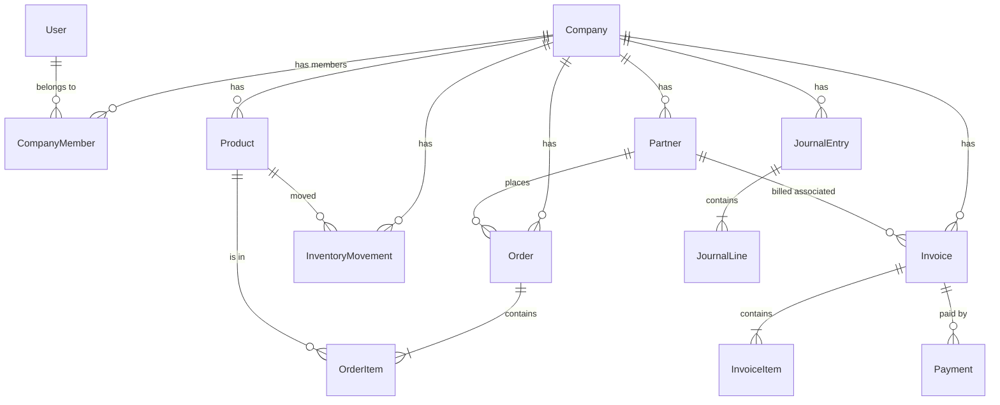

# Data Model: Sync ERP MVP

**Feature**: Sync ERP MVP
**Spec**: [specs/001-sync-erp-mvp/spec.md](spec.md)

## Entity Relationship Diagram (Draft)



## Schema Definitions (Prisma)

### Core

```prisma
model Company {
  id        String   @id @default(uuid())
  name      String
  createdAt DateTime @default(now())

  members   CompanyMember[]
  partners  Partner[]
  products  Product[]
  // ... other relations
}

model User {
  id        String   @id @default(uuid())
  email     String   @unique
  name      String

  companies CompanyMember[]
}

model CompanyMember {
  id        String   @id @default(uuid())
  userId    String
  companyId String
  roleId    String?  // Relation to RBAC Role

  user      User     @relation(fields: [userId], references: [id])
  company   Company  @relation(fields: [companyId], references: [id])
  role      Role?    @relation(fields: [roleId], references: [id])

  @@unique([userId, companyId])
}
```

### Master Data

```prisma
model Partner {
  id        String   @id @default(uuid())
  companyId String
  type      PartnerType // CUSTOMER | SUPPLIER
  name      String
  email     String?
  phone     String?
  address   String?

  company   Company @relation(fields: [companyId], references: [id])
  orders    Order[]
  invoices  Invoice[]
}

model Product {
  id        String   @id @default(uuid())
  companyId String
  sku       String
  name      String
  price     Decimal
  averageCost Decimal @default(0) // Inventory Valuation (AVCO)
  stockQty  Int      @default(0) // Denormalized for performance, verified by movements

  company   Company @relation(fields: [companyId], references: [id])
  orderItems OrderItem[]
  movements InventoryMovement[]
}
```

### Transactions (Sales & Purchasing)

```prisma
model Order {
  id          String      @id @default(uuid())
  companyId   String
  partnerId   String
  type        OrderType   // SALES | PURCHASE
  status      OrderStatus // DRAFT | CONFIRMED | COMPLETED | CANCELLED
  date        DateTime    @default(now())
  totalAmount Decimal

  company     Company     @relation(fields: [companyId], references: [id])
  partner     Partner     @relation(fields: [partnerId], references: [id])
  items       OrderItem[]
  invoices    Invoice[]
}

model OrderItem {
  id        String  @id @default(uuid())
  orderId   String
  productId String
  quantity  Int
  price     Decimal

  order     Order   @relation(fields: [orderId], references: [id])
  product   Product @relation(fields: [productId], references: [id])
}
```

### Inventory

```prisma
model InventoryMovement {
  id        String       @id @default(uuid())
  companyId String
  productId String
  type      MovementType // IN | OUT
  quantity  Int
  reference String?      // PO/SO ID
  date      DateTime     @default(now())

  company   Company @relation(fields: [companyId], references: [id])
  product   Product @relation(fields: [productId], references: [id])
}
```

### Finance

```prisma
model Invoice {
  id        String        @id @default(uuid())
  companyId String
  orderId   String?
  partnerId String
  type      InvoiceType   // INVOICE (AR) | BILL (AP)
  status    InvoiceStatus // DRAFT | POSTED | PAID
  dueDate   DateTime
  amount    Decimal
  balance   Decimal       // Remaining amount

  company   Company   @relation(fields: [companyId], references: [id])
  order     Order?    @relation(fields: [orderId], references: [id])
  partner   Partner   @relation(fields: [partnerId], references: [id])
  payments  Payment[]
}

model Payment {
  id        String   @id @default(uuid())
  companyId String
  invoiceId String
  amount    Decimal
  date      DateTime @default(now())
  method    String

  company   Company @relation(fields: [companyId], references: [id])
  invoice   Invoice @relation(fields: [invoiceId], references: [id])
}

model JournalEntry {
  id        String        @id @default(uuid())
  companyId String
  reference String?       // Invoice ID etc
  date      DateTime
  lines     JournalLine[]

  company   Company @relation(fields: [companyId], references: [id])
}

model JournalLine {
  id        String       @id @default(uuid())
  journalId String
  accountId String
  debit     Decimal      @default(0)
  credit    Decimal      @default(0)

  journal   JournalEntry @relation(fields: [journalId], references: [id])
}
```

### Enums

```prisma
enum PartnerType {
  CUSTOMER
  SUPPLIER
}

enum OrderType {
  SALES
  PURCHASE
}

enum OrderStatus {
  DRAFT
  CONFIRMED
  COMPLETED
  CANCELLED
}

enum MovementType {
  IN
  OUT
}

enum InvoiceType {
  INVOICE
  BILL
}

enum InvoiceStatus {
  DRAFT
  POSTED
  PAID
  VOID
}
```

### Access Control (RBAC)

```prisma
model Role {
  id        String   @id @default(uuid())
  companyId String
  name      String   // e.g. "Sales Manager"

  company   Company  @relation(fields: [companyId], references: [id])
  members   CompanyMember[]
  permissions RolePermission[]
}

model Permission {
  id        String   @id @default(uuid())
  module    String   // e.g. "SALES"
  action    String   // e.g. "CREATE"
  scope     String   // e.g. "OWN" vs "ALL"

  roles     RolePermission[]
}

model RolePermission {
  id           String @id @default(uuid())
  roleId       String
  permissionId String

  role         Role       @relation(fields: [roleId], references: [id])
  permission   Permission @relation(fields: [permissionId], references: [id])
}
```
