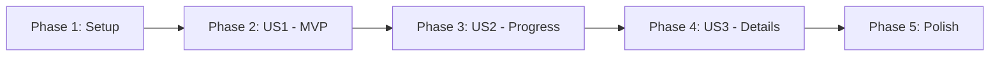

# Tasks: Interactive Getting Started Guide

**Input**: Design documents from `/specs/017-interactive-onboarding/`  
**Prerequisites**: plan.md ✓, spec.md ✓, data-model.md ✓, quickstart.md ✓

**Tests**: Optional (not explicitly requested in spec)

**Organization**: Tasks grouped by user story for independent implementation

## Format: `[ID] [P?] [Story] Description`

- **[P]**: Can run in parallel
- **[Story]**: US1, US2, US3 maps to user stories from spec.md

---

## Phase 1: Setup

**Purpose**: Add types and create folder structure

- [x] T001 Add OnboardingStep and OnboardingProgress types in `apps/web/src/features/dashboard/types.ts`
- [x] T002 Create hooks directory in `apps/web/src/features/dashboard/hooks/`
- [x] T003 Create components directory in `apps/web/src/features/dashboard/components/`

**Checkpoint**: Type definitions and folder structure ready ✅

---

## Phase 2: User Story 1 - Clickable Onboarding Steps (Priority: P1) 🎯 MVP

**Goal**: New user sees clear onboarding steps that can be clicked to navigate to relevant pages

**Independent Test**: Log in as new user, verify checklist shows all steps as pending, click on a step and verify navigation to correct page

### Implementation

- [x] T004 [US1] Create OnboardingStep component in `apps/web/src/features/dashboard/components/OnboardingStep.tsx`
  - Render step title and status icon (✓ or ○)
  - Wrap in Link to navigate to targetPath on click
  - Style with hover effects

- [x] T005 [US1] Create OnboardingGuide component in `apps/web/src/features/dashboard/components/OnboardingGuide.tsx`
  - Accept steps array as prop
  - Render list of OnboardingStep components
  - Include header "Getting Started"
  - Show progress indicator "X of Y completed"

- [x] T006 [US1] Define ONBOARDING_STEPS constant with all 6 step configurations in `apps/web/src/features/dashboard/components/OnboardingGuide.tsx`
  - create-company: "Create your first company" → /companies
  - add-products: "Add products and services" → /products
  - setup-suppliers: "Set up suppliers" → /suppliers
  - setup-customers: "Set up customers" → /customers
  - create-order: "Create your first order" → /sales-orders
  - setup-accounts: "Set up chart of accounts" → /finance

- [x] T007 [US1] Update Dashboard.tsx to replace static checklist with OnboardingGuide component in `apps/web/src/features/dashboard/pages/Dashboard.tsx`
  - Import OnboardingGuide
  - Remove existing inline Getting Started <ul>
  - Pass hardcoded steps with isCompleted=false for now

**Checkpoint**: Steps display and are clickable, navigate to correct pages ✅

---

## Phase 3: User Story 2 - Data-Driven Progress Tracking (Priority: P2)

**Goal**: Progress tracking based on actual data (products, partners, orders), not manual checkboxes

**Independent Test**: Create a product, refresh dashboard, verify "Add products" step shows as completed

### Implementation

- [x] T008 [US2] Create useOnboardingProgress hook in `apps/web/src/features/dashboard/hooks/useOnboardingProgress.ts`
  - Accept dashboard metrics as input
  - Fetch additional data for: suppliers, customers, accounts
  - Calculate completion status for each step
  - Return OnboardingProgress object with steps and counts

- [x] T009 [US2] Update OnboardingGuide to use useOnboardingProgress hook in `apps/web/src/features/dashboard/components/OnboardingGuide.tsx`
  - Remove hardcoded steps
  - Call useOnboardingProgress with metrics prop
  - Render steps from hook result

- [x] T010 [US2] Add visual progress bar showing percentage complete in `apps/web/src/features/dashboard/components/OnboardingGuide.tsx`
  - Calculate percentage from completedCount / totalCount
  - Show colorful progress bar (gradient)
  - Display "X of Y completed" text

- [x] T011 [US2] Add success state when all steps complete in `apps/web/src/features/dashboard/components/OnboardingGuide.tsx`
  - Show congratulations message when isAllComplete=true
  - Change card styling (success green border)
  - Show "Dismiss" button

**Checkpoint**: Progress updates automatically based on real data ✅

---

## Phase 4: User Story 3 - Expandable Step Details (Priority: P3)

**Goal**: Users can expand each step to see more details about what it involves

**Independent Test**: Click expand icon on a step, verify description text appears, click again to collapse

### Implementation

- [x] T012 [US3] Add expanded state to OnboardingStep component in `apps/web/src/features/dashboard/components/OnboardingStep.tsx`
  - Add local useState for isExpanded
  - Show toggle icon (chevron)
  - Render description when expanded

- [x] T013 [US3] Add detailed descriptions to ONBOARDING_STEPS constant in `apps/web/src/features/dashboard/components/OnboardingGuide.tsx`
  - create-company: "A company is your business entity..."
  - add-products: "Products are items you sell or purchase..."
  - setup-suppliers: "Suppliers are vendors you buy from..."
  - setup-customers: "Customers are people you sell to..."
  - create-order: "Orders track what you're buying or selling..."
  - setup-accounts: "Chart of accounts organizes your finances..."

**Checkpoint**: Steps can be expanded to show helpful descriptions ✅

---

## Phase 5: Polish & Cross-Cutting Concerns

**Purpose**: Final polish, dismissible state, and build verification

- [x] T014 Implement dismiss/hide functionality with localStorage persistence in `apps/web/src/features/dashboard/components/OnboardingGuide.tsx`
  - Store dismissed state in localStorage with company ID key
  - Check localStorage on mount, hide if dismissed
  - Show "Show Guide" button to restore if dismissed

- [x] T015 Add responsive styles for mobile viewport (320px min) in `apps/web/src/features/dashboard/components/OnboardingGuide.tsx`
  - Stack steps vertically
  - Ensure touch-friendly tap targets (44px min)
  - Test on mobile viewport

- [x] T016 Run TypeScript check to verify no type errors

  ```bash
  cd apps/web && npx tsc --noEmit
  ```

- [x] T017 Run build to verify production bundle

  ```bash
  cd apps/web && npm run build
  ```

- [x] T018 Manual browser testing: verify all acceptance scenarios from spec.md

**Checkpoint**: Feature complete and verified ✅

---

## Summary

| Phase     | Story  | Tasks  | Description                       | Status |
| --------- | ------ | ------ | --------------------------------- | ------ |
| 1         | Setup  | 3      | Types and folder structure        | [ ]    |
| 2         | US1    | 4      | Clickable steps (MVP)             | [ ]    |
| 3         | US2    | 4      | Data-driven progress tracking     | [ ]    |
| 4         | US3    | 2      | Expandable step details           | [ ]    |
| 5         | Polish | 5      | Dismiss, responsive, verification | [ ]    |
| **Total** |        | **18** |                                   |        |

---

## Dependencies



**Notes**:

- US1 is the MVP - can be deployed independently
- US2 builds on US1 (adds data-driven status)
- US3 builds on US2 (adds expandable details)
- Polish can run after US2 if US3 is skipped

---

## Parallel Execution Opportunities

### Within Phase 2 (US1):

- T004 and T006 can run in parallel (component vs constants)

### Within Phase 3 (US2):

- T008 creates hook, T009-T011 depend on it (sequential)

### Within Phase 5 (Polish):

- T014 and T015 can run in parallel (dismiss vs responsive)
- T016-T018 must be sequential (verification)

---

## Implementation Strategy

### MVP Scope (Recommended First Release)

- Phase 1 (Setup): T001-T003
- Phase 2 (US1): T004-T007
- Deploy and gather feedback

### Full Feature

- Add Phase 3 (US2) for real progress tracking
- Add Phase 4 (US3) for expandable details
- Add Phase 5 (Polish) for dismiss and mobile
