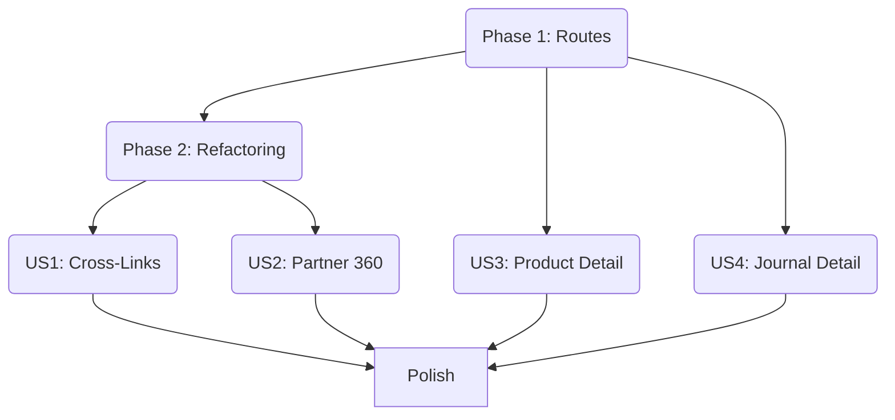

# Implementation Tasks: Enhanced Detail Pages

**Branch**: `019-optimize-details` | **Spec**: [spec.md](spec.md)
**Status**: Generated

## Phase 1: Setup

> **Goal**: Prepare routing and shared infrastructure.

- [x] T001 Define Routes for new Detail pages (Customer, Supplier, Product, Journal) in `apps/web/src/app/App.tsx` (using placeholders).

## Phase 2: Foundational (Refactoring)

> **Goal**: Extract reusable Table components to enable "History Views" without code duplication.
> **Blocking**: Must be done before building Partner Detail pages.

- [x] T002 Extract `SalesOrderList` component from `SalesOrders.tsx` to `features/sales/components/SalesOrderList.tsx`.
- [x] T003 Extract `PurchaseOrderList` component from `PurchaseOrders.tsx` to `features/procurement/components/PurchaseOrderList.tsx`.
- [x] T004: Extract `InvoiceList` component from `Invoices.tsx` to `features/finance/components/InvoiceList.tsx`.
  - [x] Ensure it accepts a `filter` prop (e.g., `{ partnerId?: string, orderId?: string }`).
  - [x] Use `InvoiceList` in `Invoices.tsx`.
  - [x] Use `InvoiceList` in `CustomerDetail.tsx` (T002).
- [x] T005: Extract `BillList` component from `AccountsPayable.tsx` to `features/finance/components/BillList.tsx`.
  - [x] Ensure it accepts a `filter` prop.
  - [x] Use `BillList` in `AccountsPayable.tsx`.
  - [x] Use `BillList` in `SupplierDetail.tsx` (T003).
- [x] T006: Ensure `InvoiceList` and `BillList` handle passed filters correctly to fetch specific data.
- [x] T006a: Update `billService.ts` and `invoiceService.ts` to support filtering list by `partnerId` or `orderId`.

## Phase 3: Cross-Module Navigation (US1)

> **Goal**: Optimize existing Transaction Detail pages with cross-links.
> **Story**: US1 (Priority P1)

- [x] T007: Update `features/sales/pages/SalesOrderDetail.tsx` to display "Related Invoices" using `<InvoiceList filter={{ orderId }} />`.
- [x] T007a: Ensure `SalesOrderDetail.tsx` displays "Shipment Status" badge (FR-012).
- [x] T008: Update `features/procurement/pages/PurchaseOrderDetail.tsx` to display "Related Bills" using `<BillList filter={{ orderId }} />`.
- [x] T009: Update `features/finance/pages/InvoiceDetail.tsx` to add "Source Order" link in header/metadata.
- [x] T010: Update `features/finance/pages/BillDetail.tsx` to add "Source Order" link in header/metadata.

## Phase 4: Resolution & Polish

> **Goal**: Build Customer/Supplier Detail pages with full history.
> **Story**: US2 (Priority P1)

- [x] T011: Resolve persistent `react-hooks/exhaustive-deps` lint errors in `CustomerDetail.tsx` and `SupplierDetail.tsx`.
- [x] T011: Implement `CustomerDetail` page (Basic Info + Sales History)
- [x] T012: Update `SalesOrder` list to link to `CustomerDetail`
- [x] T013: Implement `SupplierDetail` page (Basic Info + Purchase History)
- [x] T014: Implement `ProductDetail` page (Info + Stock Movements)
- [x] T015: Update `SalesOrderDetail` to link to Customer/Products

## Phase 5: Product Drill-Down (US3)

> **Goal**: Build Product Detail page.
> **Story**: US3 (Priority P2)

- [x] T016 [US3] Create `ProductDetail` page in `features/inventory/pages/ProductDetail.tsx`.
- [x] T017 [US3] Implement `ProductDetail` UI: Stock Info + Movements History (reuse Inventory list logic?).
- [x] T018 [US3] Update Sales/Purchase Order Item tables to hyperlink Product Names to `ProductDetail`.

## Phase 6: Financial Audit (US4)

> **Goal**: Build Journal Detail page.
> **Story**: US4 (Priority P2)

- [x] T019 [US4] Create `JournalDetail` page in `features/finance/pages/JournalDetail.tsx` displaying Ledger Lines.
- [x] T020 [US4] Update `JournalEntries` list in `features/finance/pages/JournalEntries.tsx` to link to `JournalDetail`.

## Phase 7: Polish

- [ ] T021 Manual Verification: Test full cycle Order -> Invoice -> Partner -> History -> Product -> Stock.
- [ ] T022 Clean up any temporary TODOs or console logs.

## Dependency Graph

