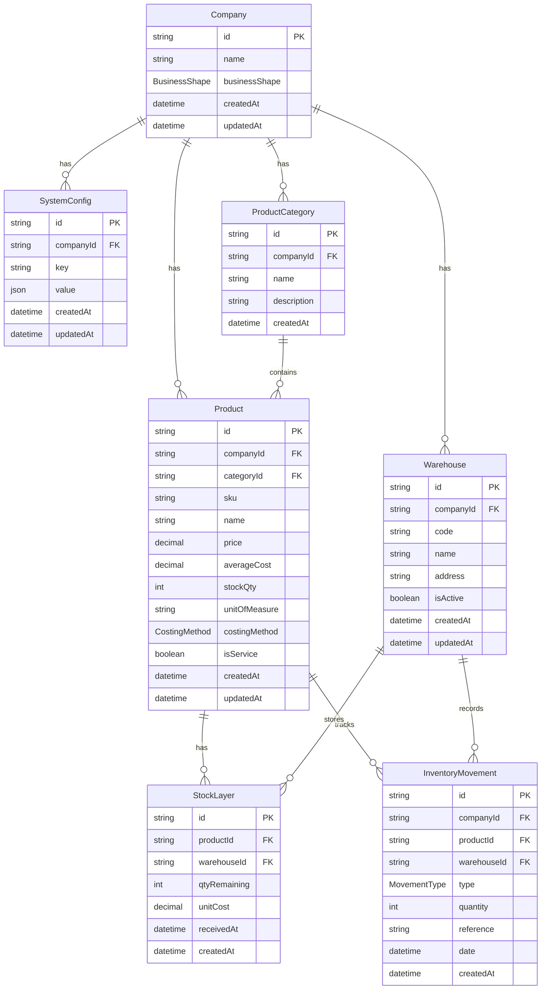

# Data Model: Apple-Style Backend Core Refactor

**Feature**: 020-apple-backend-refactor
**Date**: 2025-12-16
**Status**: Complete

## Overview

This document defines the data model changes required for the backend refactor. All changes are **additive** to preserve backward compatibility.

---

## Entity Diagram



---

## Enums

### BusinessShape

| Value           | Description                                                          |
| --------------- | -------------------------------------------------------------------- |
| `PENDING`       | Initial state. All business operations blocked until shape selected. |
| `RETAIL`        | Retail/Trading business. Stock tracking enabled, no WIP.             |
| `MANUFACTURING` | Manufacturing business. Full inventory features including WIP.       |
| `SERVICE`       | Service business. No physical stock tracking.                        |

### CostingMethod

| Value  | Description                                    |
| ------ | ---------------------------------------------- |
| `AVG`  | Weighted Average Cost. Default for Retail.     |
| `FIFO` | First-In First-Out. Default for Manufacturing. |

### MovementType (Existing)

| Value        | Description                           |
| ------------ | ------------------------------------- |
| `IN`         | Stock received (purchase, production) |
| `OUT`        | Stock issued (sale, consumption)      |
| `ADJUSTMENT` | Manual stock adjustment               |

---

## New Entities

### SystemConfig

Stores per-company configuration flags.

| Field       | Type     | Constraints  | Description           |
| ----------- | -------- | ------------ | --------------------- |
| `id`        | UUID     | PK           | Primary key           |
| `companyId` | UUID     | FK → Company | Owner company         |
| `key`       | String   | Required     | Config key name       |
| `value`     | JSON     | Required     | Config value (typed)  |
| `createdAt` | DateTime | Auto         | Creation timestamp    |
| `updatedAt` | DateTime | Auto         | Last update timestamp |

**Constraints**:

- `@@unique([companyId, key])` - One value per key per company

**Known Keys**:

| Key                    | Type    | Default (RETAIL) | Default (MANUFACTURING) | Default (SERVICE) |
| ---------------------- | ------- | ---------------- | ----------------------- | ----------------- |
| `enableReservation`    | boolean | false            | true                    | false             |
| `enableMultiWarehouse` | boolean | false            | true                    | false             |
| `enableApprovalFlow`   | boolean | false            | false                   | false             |
| `accountingBasis`      | enum    | CASH             | ACCRUAL                 | CASH              |

---

### Warehouse

Physical or logical stock location.

| Field       | Type     | Constraints                  | Description           |
| ----------- | -------- | ---------------------------- | --------------------- |
| `id`        | UUID     | PK                           | Primary key           |
| `companyId` | UUID     | FK → Company                 | Owner company         |
| `code`      | String   | Required, Unique per company | Short identifier      |
| `name`      | String   | Required                     | Display name          |
| `address`   | String   | Optional                     | Physical address      |
| `isActive`  | Boolean  | Default true                 | Soft delete flag      |
| `createdAt` | DateTime | Auto                         | Creation timestamp    |
| `updatedAt` | DateTime | Auto                         | Last update timestamp |

**Constraints**:

- `@@unique([companyId, code])` - Unique code per company

---

### ProductCategory

Categorization for products.

| Field         | Type     | Constraints  | Description          |
| ------------- | -------- | ------------ | -------------------- |
| `id`          | UUID     | PK           | Primary key          |
| `companyId`   | UUID     | FK → Company | Owner company        |
| `name`        | String   | Required     | Category name        |
| `description` | String   | Optional     | Category description |
| `createdAt`   | DateTime | Auto         | Creation timestamp   |

---

### StockLayer (Future FIFO Support)

Tracks batch/layer quantities for FIFO costing.

| Field          | Type     | Constraints    | Description                 |
| -------------- | -------- | -------------- | --------------------------- |
| `id`           | UUID     | PK             | Primary key                 |
| `productId`    | UUID     | FK → Product   | Product reference           |
| `warehouseId`  | UUID     | FK → Warehouse | Warehouse reference         |
| `qtyRemaining` | Int      | Required       | Remaining quantity in layer |
| `unitCost`     | Decimal  | Required       | Cost per unit when received |
| `receivedAt`   | DateTime | Required       | When layer was created      |
| `createdAt`    | DateTime | Auto           | Creation timestamp          |

**Note**: This table is created but **not actively used** in MVP. It prepares the schema for future FIFO costing (Phase 3).

---

## Modified Entities

### Company (MODIFY)

| Field           | Change | Type          | Notes            |
| --------------- | ------ | ------------- | ---------------- |
| `businessShape` | ADD    | BusinessShape | Default: PENDING |

---

### Product (MODIFY)

| Field           | Change | Type          | Notes                          |
| --------------- | ------ | ------------- | ------------------------------ |
| `categoryId`    | ADD    | UUID?         | Optional FK to ProductCategory |
| `unitOfMeasure` | ADD    | String        | Default: "PCS"                 |
| `costingMethod` | ADD    | CostingMethod | Default: AVG                   |
| `isService`     | ADD    | Boolean       | Default: false                 |

---

### InventoryMovement (MODIFY)

| Field         | Change | Type  | Notes                    |
| ------------- | ------ | ----- | ------------------------ |
| `warehouseId` | ADD    | UUID? | Optional FK to Warehouse |

---

## Validation Rules

### BusinessShape Transitions

```
PENDING → RETAIL (one-time only)
PENDING → MANUFACTURING (one-time only)
PENDING → SERVICE (one-time only)
RETAIL → (immutable)
MANUFACTURING → (immutable)
SERVICE → (immutable)
```

### Product.costingMethod Assignment

When a product is created:

1. If `isService = true` → `costingMethod = null` (not applicable)
2. If company shape is RETAIL → default to `AVG`
3. If company shape is MANUFACTURING → default to `FIFO`

---

## Migration SQL (Preview)

```sql
-- Add BusinessShape enum
CREATE TYPE "BusinessShape" AS ENUM ('PENDING', 'RETAIL', 'MANUFACTURING', 'SERVICE');

-- Add CostingMethod enum
CREATE TYPE "CostingMethod" AS ENUM ('AVG', 'FIFO');

-- Modify Company
ALTER TABLE "Company" ADD COLUMN "businessShape" "BusinessShape" NOT NULL DEFAULT 'PENDING';

-- Create SystemConfig
CREATE TABLE "SystemConfig" (
  "id" UUID PRIMARY KEY DEFAULT gen_random_uuid(),
  "companyId" UUID NOT NULL REFERENCES "Company"("id") ON DELETE CASCADE,
  "key" VARCHAR NOT NULL,
  "value" JSONB NOT NULL,
  "createdAt" TIMESTAMP DEFAULT NOW(),
  "updatedAt" TIMESTAMP DEFAULT NOW(),
  UNIQUE("companyId", "key")
);

-- Create Warehouse
CREATE TABLE "Warehouse" (
  "id" UUID PRIMARY KEY DEFAULT gen_random_uuid(),
  "companyId" UUID NOT NULL REFERENCES "Company"("id") ON DELETE CASCADE,
  "code" VARCHAR NOT NULL,
  "name" VARCHAR NOT NULL,
  "address" VARCHAR,
  "isActive" BOOLEAN DEFAULT TRUE,
  "createdAt" TIMESTAMP DEFAULT NOW(),
  "updatedAt" TIMESTAMP DEFAULT NOW(),
  UNIQUE("companyId", "code")
);

-- Create ProductCategory
CREATE TABLE "ProductCategory" (
  "id" UUID PRIMARY KEY DEFAULT gen_random_uuid(),
  "companyId" UUID NOT NULL REFERENCES "Company"("id") ON DELETE CASCADE,
  "name" VARCHAR NOT NULL,
  "description" VARCHAR,
  "createdAt" TIMESTAMP DEFAULT NOW()
);

-- Create StockLayer
CREATE TABLE "StockLayer" (
  "id" UUID PRIMARY KEY DEFAULT gen_random_uuid(),
  "productId" UUID NOT NULL REFERENCES "Product"("id") ON DELETE CASCADE,
  "warehouseId" UUID NOT NULL REFERENCES "Warehouse"("id") ON DELETE CASCADE,
  "qtyRemaining" INTEGER NOT NULL,
  "unitCost" DECIMAL(15,2) NOT NULL,
  "receivedAt" TIMESTAMP NOT NULL,
  "createdAt" TIMESTAMP DEFAULT NOW()
);

-- Modify Product
ALTER TABLE "Product"
  ADD COLUMN "categoryId" UUID REFERENCES "ProductCategory"("id"),
  ADD COLUMN "unitOfMeasure" VARCHAR DEFAULT 'PCS',
  ADD COLUMN "costingMethod" "CostingMethod" DEFAULT 'AVG',
  ADD COLUMN "isService" BOOLEAN DEFAULT FALSE;

-- Modify InventoryMovement
ALTER TABLE "InventoryMovement"
  ADD COLUMN "warehouseId" UUID REFERENCES "Warehouse"("id");
```

---

## Index Strategy

| Table           | Index                      | Purpose                     |
| --------------- | -------------------------- | --------------------------- |
| SystemConfig    | `companyId`                | Fast config lookup          |
| Warehouse       | `companyId`                | List warehouses per company |
| ProductCategory | `companyId`                | List categories per company |
| StockLayer      | `productId`, `warehouseId` | FIFO layer lookup           |
| StockLayer      | `warehouseId, receivedAt`  | FIFO ordering               |
