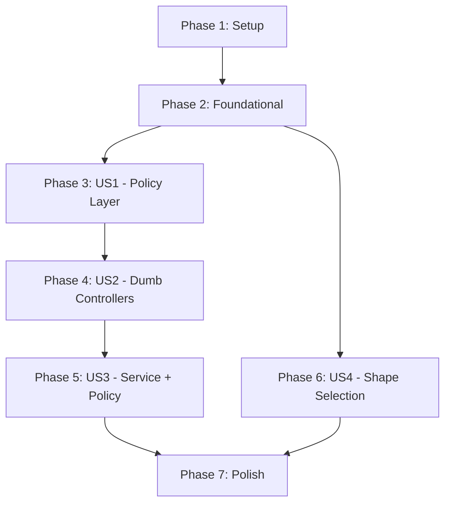

# Tasks: Apple-Style Backend Core Refactor

**Input**: Design documents from `/specs/020-apple-backend-refactor/`
**Prerequisites**: plan.md ✓, spec.md ✓, research.md ✓, data-model.md ✓, contracts/ ✓

**Tests**: Tests are included for Policy layer (critical for verification).

**Organization**: Tasks are grouped by user story for independent implementation.

## Format: `[ID] [P?] [Story] Description`

- **[P]**: Can run in parallel (different files, no dependencies)
- **[Story]**: Which user story this task belongs to (US1, US2, US3, US4)

---

## Phase 1: Setup (Shared Infrastructure)

**Purpose**: Shared type contracts and error handling infrastructure

- [ ] T001 Create `BusinessShape` enum in `packages/shared/src/types/company.ts`
- [ ] T002 [P] Create `CostingMethod` enum in `packages/shared/src/types/company.ts`
- [ ] T003 [P] Create `DomainError` class in `packages/shared/src/errors/domain-error.ts`
- [ ] T004 Export new types from `packages/shared/src/index.ts`
- [ ] T005 Create Zod schema `SelectShapeSchema` in `packages/shared/src/validators/company.ts`
- [ ] T006 Export new validators from `packages/shared/src/validators/index.ts`
- [ ] T007 Run `npm run build` in `packages/shared`

**Checkpoint**: Shared package compiles with new types. `npx tsc --noEmit` passes.

---

## Phase 2: Foundational (Database Schema)

**Purpose**: Core infrastructure that MUST be complete before ANY user story can begin

**⚠️ CRITICAL**: No user story work can begin until this phase is complete

- [ ] T008 Add `BusinessShape` enum to `packages/database/prisma/schema.prisma`
- [ ] T009 [P] Add `CostingMethod` enum to Prisma schema
- [ ] T010 Add `businessShape` field to `Company` model (default: PENDING)
- [ ] T011 [P] Create `SystemConfig` model in Prisma schema
- [ ] T012 [P] Create `Warehouse` model in Prisma schema
- [ ] T013 [P] Create `ProductCategory` model in Prisma schema
- [ ] T014 [P] Create `StockLayer` model in Prisma schema (future FIFO)
- [ ] T015 Add `categoryId`, `unitOfMeasure`, `costingMethod`, `isService` to `Product` model
- [ ] T016 Add `warehouseId` to `InventoryMovement` model
- [ ] T017 Run `npx prisma migrate dev --name add_business_shape`
- [ ] T018 Run `npx prisma generate`
- [ ] T019 Update `apps/api/src/types/express.d.ts` to include `shape` in `req.company`
- [ ] T020 Update `authMiddleware` in `apps/api/src/middlewares/auth.ts` to load `businessShape` into `req.company`

**Checkpoint**: Database migrated. `req.company.shape` available in all routes.

---

## Phase 3: User Story 1 - Backend Rejects Illegal Business Operations (Priority: P1) 🎯 MVP

**Goal**: Backend automatically rejects operations that don't match company's Business Shape

**Independent Test**: Call "Create WIP" API on RETAIL company → returns 400 Domain Error

### Policy Layer

- [ ] T021 [US1] Create `apps/api/src/modules/inventory/inventory.constants.ts` with movement types
- [ ] T022 [US1] Create `apps/api/src/modules/inventory/inventory.policy.ts` with:
  - `canAdjustStock(shape)` → returns false for SERVICE
  - `canCreateWIP(shape)` → returns true only for MANUFACTURING
  - `ensureCanAdjustStock(shape)` → throws DomainError if cannot
  - `ensureCanCreateWIP(shape)` → throws DomainError if cannot
- [ ] T023 [P] [US1] Create `apps/api/src/modules/sales/sales.policy.ts` with:
  - `canSellPhysicalGoods(shape)` → returns false for SERVICE
  - `ensureCanSellPhysicalGoods(shape)` → throws DomainError if cannot
- [ ] T046 [P] [US1] Create `apps/api/src/modules/procurement/procurement.policy.ts` with:
  - `canPurchasePhysicalGoods(shape)` → returns false for SERVICE
  - `ensureCanPurchasePhysicalGoods(shape)` → throws DomainError if cannot
- [ ] T024 [P] [US1] Create `apps/api/src/modules/company/company.policy.ts` with:
  - `canSelectShape(currentShape)` → returns true only if PENDING
  - `ensureCanSelectShape(currentShape)` → throws DomainError if not PENDING

### Policy Tests

- [ ] T025 [P] [US1] Create `apps/api/src/modules/inventory/inventory.policy.test.ts`:
  - Test `canAdjustStock` returns false for SERVICE
  - Test `canAdjustStock` returns true for RETAIL/MANUFACTURING
  - Test `canCreateWIP` returns true only for MANUFACTURING
  - Test `ensureCanAdjustStock` throws DomainError for SERVICE
- [ ] T026 [P] [US1] Create `apps/api/src/modules/sales/sales.policy.test.ts`:
  - Test `canSellPhysicalGoods` returns false for SERVICE
  - Test `ensureCanSellPhysicalGoods` throws DomainError for SERVICE

**Checkpoint (US1)**: Policy classes created and tested. Zero business logic in controllers yet.

---

## Phase 4: User Story 2 - Controllers Have Zero Business Logic (Priority: P2)

**Goal**: All business logic moved from Controllers to Service/Rules layers

**Independent Test**: Review `InventoryController` - no `if/else` for business rules

### Rules Layer

- [ ] T027 [US2] Create `apps/api/src/modules/inventory/rules/stockRule.ts`:
  - `ensureAvailableStock(availableQty, requestedQty)` → throws if insufficient
  - `calculateNewAvgCost(oldQty, oldAvg, inQty, inPrice)` → returns new average
- [ ] T028 [P] [US2] Create `apps/api/src/modules/inventory/rules/reservationRule.ts`:
  - `ensureReservable(availableQty, reservedQty, requestedQty)` → throws if cannot reserve

### Repository Layer

- [ ] T029 [US2] Create `apps/api/src/modules/inventory/inventory.repository.ts`:
  - `findStock(productId, warehouseId)` → StockItem | null
  - `createStockMovement(data)` → StockMovement
  - `updateStockQuantity(stockItemId, quantity, reservedQuantity)` → void
  - `createWarehouse(data)` → Warehouse

### Controller Cleanup

- [ ] T030 [US2] Refactor `apps/api/src/modules/inventory/inventory.controller.ts`:
  - Remove ALL business logic
  - Keep ONLY: (1) extract req.body, (2) call service, (3) return res.json()
  - Add try-catch for DomainError → return 400 with message
- [ ] T031 [P] [US2] Refactor `apps/api/src/modules/sales/sales.controller.ts`:
  - Same pattern: remove logic, delegate to service
- [ ] T048 [P] [US2] Refactor `apps/api/src/modules/procurement/procurement.controller.ts`:
  - Same pattern: remove logic, delegate to service

**Checkpoint (US2)**: Controllers are "dumb adapters". All logic in Service/Rules.

---

## Phase 5: User Story 3 - Services Consult Policy Before Acting (Priority: P2)

**Goal**: Every Service method consults Policy before Repository

**Independent Test**: Unit test `InventoryPolicy.canAdjustStock()` - returns false for SERVICE

### Service Refactor

- [ ] T032 [US3] Refactor `apps/api/src/modules/inventory/inventory.service.ts`:
  - Import `InventoryPolicy` and `InventoryRepository`
  - Import Rules from `rules/stockRule.ts`
  - Add `adjustStock(companyId, dto)`:
    1. Get company shape from context
    2. `InventoryPolicy.ensureCanAdjustStock(shape)` ← Policy FIRST
    3. Call repository methods
  - Add `createWIP(companyId, dto)`:
    1. `InventoryPolicy.ensureCanCreateWIP(shape)` ← Policy FIRST
    2. Call repository methods
- [ ] T033 [P] [US3] Refactor `apps/api/src/modules/sales/sales.service.ts`:
  - Import `SalesPolicy`
  - Before creating orders with physical goods:
    1. `SalesPolicy.ensureCanSellPhysicalGoods(shape)` ← Policy FIRST
    2. Continue with order creation
- [ ] T047 [P] [US3] Refactor `apps/api/src/modules/procurement/procurement.service.ts`:
  - Import `ProcurementPolicy`
  - Before creating purchase orders with physical goods:
    1. `ProcurementPolicy.ensureCanPurchasePhysicalGoods(shape)` ← Policy FIRST
    2. Continue with order creation

### Service Integration Tests

- [ ] T034 [P] [US3] Create `apps/api/src/modules/inventory/inventory.service.test.ts`:
  - Test `adjustStock` throws DomainError for SERVICE company
  - Test `adjustStock` succeeds for RETAIL company
  - Test `createWIP` throws DomainError for RETAIL company
  - Test `createWIP` succeeds for MANUFACTURING company

**Checkpoint (US3)**: Services always check Policy before Repository.

---

## Phase 6: User Story 4 - Business Shape is First-Class Citizen (Priority: P1)

**Goal**: Company has mandatory `businessShape` field, immutable once set

**Independent Test**: `POST /company/select-shape` succeeds once, fails on retry

### Shape Selection Service

- [ ] T035 [US4] Create `apps/api/src/modules/company/company.repository.ts`:
  - `findById(companyId)` → Company | null
  - `updateShape(companyId, shape)` → Company
- [ ] T036 [US4] Update `apps/api/src/modules/company/company.service.ts`:
  - Add `selectShape(companyId, newShape)`:
    1. Get current company
    2. `CompanyPolicy.ensureCanSelectShape(company.shape)` ← Policy FIRST
    3. Update company shape
    4. Call `seedSystemConfig(companyId, newShape)`
    5. Call `seedChartOfAccounts(companyId, newShape)`
    6. Return success response
  - Add `seedSystemConfig(companyId, shape)` → creates default config entries
  - Add `seedChartOfAccounts(companyId, shape)` → creates shape-appropriate CoA

### Shape Selection Controller

- [ ] T037 [US4] Update `apps/api/src/modules/company/company.controller.ts`:
  - Add `selectShape(req, res)`:
    1. Validate `req.body` with `SelectShapeSchema`
    2. Call `companyService.selectShape(req.company.id, req.body.shape)`
    3. Return `res.json(result)`
- [ ] T038 [US4] Update `apps/api/src/routes/company.ts`:
  - Add route `POST /company/select-shape` → `CompanyController.selectShape`

### Shape Selection Tests

- [ ] T039 [P] [US4] Create `apps/api/src/modules/company/company.service.test.ts`:
  - Test `selectShape` succeeds when current shape is PENDING
  - Test `selectShape` throws DomainError when shape already set
  - Test `selectShape` seeds SystemConfig for selected shape
  - Test `selectShape` seeds CoA for selected shape

**Checkpoint (US4)**: Shape selection works once, auto-seeds config and CoA.

---

## Phase 7: Polish & Verification

**Purpose**: Final validation and cross-cutting concerns

- [ ] T040 Run `npx tsc --noEmit` in `apps/api` - must pass with zero errors
- [ ] T041 Run `npm run test` - all tests must pass
- [ ] T042 Run `npm run build` - production build must succeed
- [ ] T043 Manual test: Create PENDING company, select RETAIL shape, verify config seeded
- [ ] T044 Manual test: Try to select shape again - verify 400 error
- [ ] T045 Manual test: Try to adjust stock in SERVICE company - verify 400 error

**Checkpoint**: All success criteria met. Ready for PR.

---

## Dependencies



**User Story Independence**:

- US1 (Policy Layer) and US4 (Shape Selection) can start in parallel after Phase 2
- US2 and US3 depend on US1 completion
- All stories merge in Phase 7 for final verification

---

## Parallel Execution Opportunities

### Phase 1 Parallel Group

```
T002, T003 can run in parallel (different files)
```

### Phase 2 Parallel Group

```
T009, T011, T012, T013, T014 can run in parallel (different models)
```

### Phase 3 Parallel Group

```
T023, T024, T025, T026 can run in parallel (different policy files)
```

### Phase 4-5-6 Parallel Group

```
T028, T031, T033, T034, T039 can run in parallel (different service/test files)
```

---

## Summary

| Metric                 | Value    |
| ---------------------- | -------- |
| Total Tasks            | 48       |
| Phase 1 (Setup)        | 7 tasks  |
| Phase 2 (Foundation)   | 13 tasks |
| Phase 3 (US1)          | 7 tasks  |
| Phase 4 (US2)          | 6 tasks  |
| Phase 5 (US3)          | 4 tasks  |
| Phase 6 (US4)          | 5 tasks  |
| Phase 7 (Polish)       | 6 tasks  |
| Parallel Opportunities | 21 tasks |

### MVP Scope

**Suggested MVP**: Complete Phases 1-3 only (US1: Policy Layer)

- This gives you the foundational "reject illegal operations" behavior
- Other stories can be added incrementally

### Implementation Strategy

1. **Day 1**: Phases 1-2 (Schema foundation)
2. **Day 2**: Phase 3 (Policy layer + tests)
3. **Day 3**: Phases 4-5 (Controller + Service refactor)
4. **Day 4**: Phase 6 (Shape selection endpoint)
5. **Day 5**: Phase 7 (Polish + verification)
