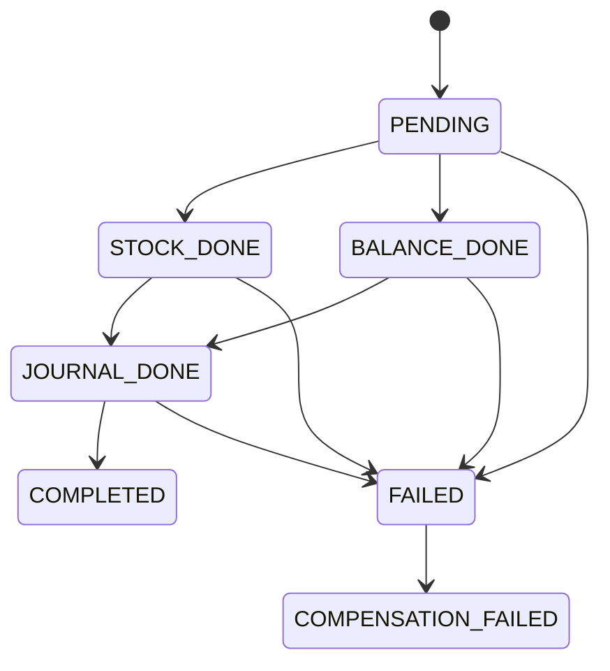

# Data Model: SAGA Transaction Safety

## Overview

Complete data model for saga transaction tracking across all modules.

---

## Entities

### SagaLog

| Field     | Type     | Constraints | Description                       |
| --------- | -------- | ----------- | --------------------------------- |
| id        | UUID     | PK, auto    | Saga log ID                       |
| sagaType  | SagaType | NOT NULL    | Type of saga                      |
| entityId  | String   | NOT NULL    | Document ID (Invoice, Order, etc) |
| companyId | String   | FK          | Company                           |
| step      | SagaStep | NOT NULL    | Current step                      |
| stepData  | JSON     | NULLABLE    | IDs created per step              |
| error     | String   | NULLABLE    | Error message                     |
| createdAt | DateTime | NOT NULL    | Start time                        |
| updatedAt | DateTime | NOT NULL    | Last step time                    |

**Indexes:**

- `@@index([entityId])`
- `@@index([companyId, sagaType, step])`

---

## Enums

### SagaType

| Value          | Module      | Operation          |
| -------------- | ----------- | ------------------ |
| INVOICE_POST   | Sales       | Post invoice       |
| SHIPMENT       | Sales       | Ship order         |
| GOODS_RECEIPT  | Procurement | Receive goods      |
| BILL_POST      | Procurement | Post bill          |
| PAYMENT_POST   | Accounting  | Apply payment      |
| CREDIT_NOTE    | Sales       | Create credit note |
| STOCK_TRANSFER | Inventory   | WH transfer        |
| STOCK_RETURN   | Inventory   | Customer return    |

### SagaStep

| Value               | Description                |
| ------------------- | -------------------------- |
| PENDING             | Started, no steps done     |
| STOCK_DONE          | Stock movement completed   |
| BALANCE_DONE        | Balance updated (payments) |
| JOURNAL_DONE        | Journal created            |
| COMPLETED           | Fully successful           |
| FAILED              | Failed, compensated        |
| COMPENSATION_FAILED | Needs manual intervention  |

---

## StepData Schema

```json
{
  "stockMovementId": "mov-123",
  "stockMovementId2": "mov-456",
  "journalId": "jnl-789",
  "previousBalance": 1000
}
```

---

## State Transitions


