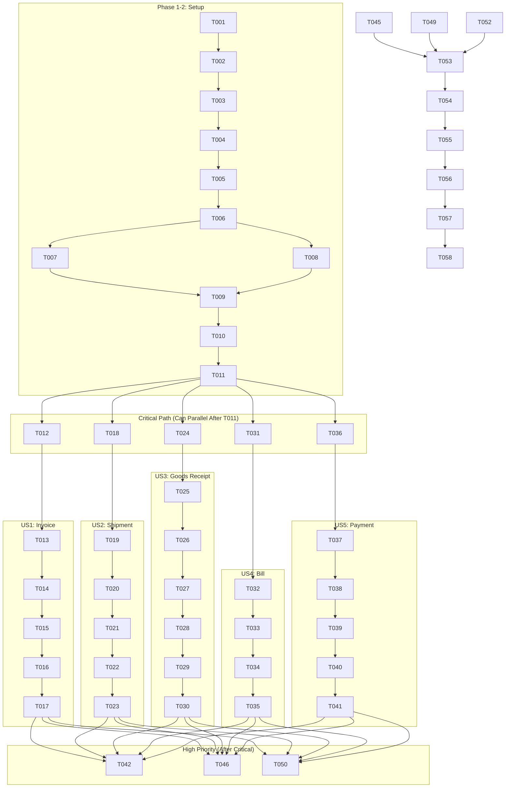

# Tasks: SAGA Transaction Safety

## Meta

| Property    | Value                       |
| ----------- | --------------------------- |
| Feature ID  | 022                         |
| Branch      | 022-saga-transaction-safety |
| Created     | 2025-12-16                  |
| Status      | Ready for Implementation    |
| Total Sagas | 8                           |
| Est. Effort | 14.5 hours                  |

---

## Phase 1: Setup (Schema & Infrastructure)

- [x] T001 Add SagaLog model to `packages/database/prisma/schema.prisma`
- [x] T002 Add SagaType enum (INVOICE_POST, SHIPMENT, GOODS_RECEIPT, BILL_POST, PAYMENT_POST, CREDIT_NOTE, STOCK_TRANSFER, STOCK_RETURN) to schema
- [x] T003 Add SagaStep enum (PENDING, STOCK_DONE, BALANCE_DONE, JOURNAL_DONE, COMPLETED, FAILED, COMPENSATION_FAILED) to schema
- [x] T004 Run migration `npx prisma migrate dev --name add_saga`
- [x] T005 Export SagaType, SagaStep, SagaLog from `packages/database/src/index.ts`
- [x] T006 Rebuild database package

---

## Phase 2: Foundational (Core Saga Infrastructure)

- [x] T007 [P] Create `apps/api/src/modules/common/saga/saga-log.repository.ts`
- [x] T008 [P] Create `apps/api/src/modules/common/saga/posting-context.ts`
- [x] T009 Create `apps/api/src/modules/common/saga/saga-orchestrator.ts` (abstract base)
- [x] T010 Create `apps/api/src/modules/common/saga/saga-errors.ts` (SagaCompensatedError, SagaCompensationFailedError)
- [x] T011 Create unit test `apps/api/test/unit/modules/common/t021_saga_infrastructure.test.ts`

---

## Phase 3: US1 - Invoice Posting Saga (Critical)

**Goal:** Invoice posting is atomic with automatic compensation on failure.

**Test Criteria:**

- Invoice + Stock OUT + Journal → COMPLETED
- Journal fails → Stock reversed, FAILED status, zero drift

### Tasks

- [x] T012 [US1] Create `apps/api/src/modules/accounting/sagas/invoice-posting.saga.ts`
- [x] T013 [US1] Implement `executeStockOut()` step
- [x] T014 [US1] Implement `executeJournal()` step
- [x] T015 [US1] Implement `compensate()` (reverse journal, then stock)
- [x] T016 [US1] Modify `apps/api/src/modules/accounting/services/invoice.service.ts` to use saga
- [x] T017 [US1] Create unit test `apps/api/test/unit/modules/accounting/t022_invoice_posting_saga.test.ts`

---

## Phase 4: US2 - Shipment Saga (Critical)

**Goal:** Order shipment is atomic with automatic compensation.

**Test Criteria:**

- Order → Stock OUT → Movement log → COMPLETED
- Stock OUT fails → Order unchanged, FAILED

### Tasks

- [x] T018 [P] [US2] Create `apps/api/src/modules/sales/sagas/shipment.saga.ts`
- [x] T019 [US2] Implement `validateStock()` and `executeStockOut()` steps
- [x] T020 [US2] Implement `updateOrderStatus()` step
- [x] T021 [US2] Implement `compensate()` (restore stock)
- [x] T022 [US2] Modify `apps/api/src/modules/sales/sales.service.ts` ship() to use saga
- [x] T023 [P] [US2] Create unit test `apps/api/test/unit/modules/sales/t023_shipment_saga.test.ts`

---

## Phase 5: US3 - Goods Receipt Saga (Critical)

**Goal:** Goods receipt is atomic with automatic compensation.

**Test Criteria:**

- PO → Stock IN → Accrual → COMPLETED
- Accrual fails → Stock reversed, FAILED

### Tasks

- [x] T024 [P] [US3] Create `apps/api/src/modules/procurement/sagas/goods-receipt.saga.ts`
- [x] T025 [US3] Implement `executeStockIn()` step
- [x] T026 [US3] Implement `executeAccrual()` step
- [x] T027 [US3] Implement `updatePOStatus()` step
- [x] T028 [US3] Implement `compensate()` (reverse accrual, then stock)
- [x] T029 [US3] Modify goods receipt service to use saga
- [x] T030 [P] [US3] Create unit test

---

## Phase 6: US4 - Bill Posting Saga (Critical)

**Goal:** Bill posting is atomic with automatic compensation.

**Test Criteria:**

- Receipt → AP Journal → COMPLETED
- Journal fails → FAILED

### Tasks

- [x] T031 [P] [US4] Create `apps/api/src/modules/accounting/sagas/bill-posting.saga.ts`
- [x] T032 [US4] Implement `executeJournal()` step (AP)
- [x] T033 [US4] Implement `compensate()` (reverse journal)
- [x] T034 [US4] Modify bill.service.ts to use saga
- [x] T035 [P] [US4] Create unit test

---

## Phase 7: US5 - Payment Posting Saga (Critical)

**Goal:** Payment posting is atomic with automatic compensation.

**Test Criteria:**

- Payment → Balance decrease → Cash journal → COMPLETED
- Journal fails → Balance restored, FAILED

### Tasks

- [x] T036 [P] [US5] Create `apps/api/src/modules/accounting/sagas/payment-posting.saga.ts`
- [x] T037 [US5] Implement `decreaseBalance()` step
- [x] T038 [US5] Implement `executeJournal()` step (Cash)
- [x] T039 [US5] Implement `compensate()` (restore balance, reverse journal)
- [x] T040 [US5] Modify payment.service.ts to use saga
- [x] T041 [P] [US5] Create unit test

---

## Phase 8: US6 - Credit Note Saga (High Priority)

**Goal:** Credit note is atomic with automatic compensation.

### Tasks

- [x] T042 [P] [US6] Create `apps/api/src/modules/accounting/sagas/credit-note.saga.ts`
- [x] T043 [US6] Implement steps (negative stock, reversing journal)
- [x] T044 [US6] Modify credit note creation to use saga
- [x] T045 [P] [US6] Create unit test `apps/api/test/unit/modules/accounting/t027_credit_note_saga.test.ts`

---

## Phase 9: US7 - Stock Transfer Saga (High Priority)

**Goal:** Stock transfer is atomic with automatic compensation.

### Tasks

- [x] T046 [P] [US7] Create `apps/api/src/modules/inventory/sagas/stock-transfer.saga.ts`
- [x] T047 [US7] Implement `executeOutbound()` and `executeInbound()` steps
- [x] T048 [US7] Implement `compensate()` (reverse both movements)
- [x] T049 [P] [US7] Create unit test `apps/api/test/unit/modules/inventory/t028_stock_transfer_saga.test.ts`

---

## Phase 10: US8 - Stock Return Saga (High Priority)

**Goal:** Stock return is atomic with automatic compensation.

### Tasks

- [x] T050 [P] [US8] Create `apps/api/src/modules/inventory/sagas/stock-return.saga.ts`
- [x] T051 [US8] Implement steps (stock IN, cost update)
- [x] T052 [P] [US8] Create unit test `apps/api/test/unit/modules/inventory/t029_stock_return_saga.test.ts`

---

## Phase 11: Verification & Polish

- [x] T053 Run all saga tests `npm run test -- --run t021 t022 t023 t024 t025 t026 t027 t028 t029`
- [ ] T054 Run full test suite `npm run test -- --run`
- [x] T055 Run type check `npx tsc --noEmit`
- [ ] T056 Run full build `npm run build`
- [ ] T057 Update memory.md with saga decisions
- [ ] T058 Commit and push `git commit -m "feat(saga): implement transaction safety"`

---

## Dependencies

---

## Parallel Execution Opportunities

| Group          | Tasks                     | Condition                         |
| -------------- | ------------------------- | --------------------------------- |
| Infrastructure | T007, T008                | After T006                        |
| Critical Sagas | US1-US5                   | After T011 (all can run parallel) |
| High Priority  | US6-US8                   | After any Critical complete       |
| Test Files     | All test tasks marked [P] | Independent files                 |

---

## Summary

| Metric             | Value |
| ------------------ | ----- |
| **Total Tasks**    | 58    |
| Setup              | 6     |
| Foundational       | 5     |
| US1 Invoice        | 6     |
| US2 Shipment       | 6     |
| US3 Goods Receipt  | 7     |
| US4 Bill           | 5     |
| US5 Payment        | 6     |
| US6 Credit Note    | 4     |
| US7 Stock Transfer | 4     |
| US8 Stock Return   | 3     |
| Polish             | 6     |

---

## MVP Recommendation

**MVP = Phases 1-7** (Setup + Infrastructure + 5 Critical Sagas)

This covers:

- ✅ Invoice Posting (O2C)
- ✅ Shipment (O2C)
- ✅ Goods Receipt (P2P)
- ✅ Bill Posting (P2P)
- ✅ Payment (Accounting)

**Effort:** ~10 hours

**Phase 8-10 (Credit Note, Transfer, Return)**: Add after MVP validation
