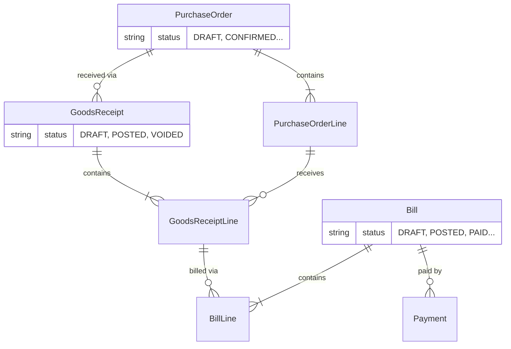

# Data Model: Procure-to-Pay (P2P)

**Spec**: [spec.md](../spec.md) | **Research**: [research.md](../research.md)

## Entities

### PurchaseOrder (PO)

_Represents a commitment to purchase goods._

| Field          | Type          | Required | Description                                               |
| :------------- | :------------ | :------- | :-------------------------------------------------------- |
| `id`           | String (CUID) | Yes      | PK                                                        |
| `companyId`    | String        | Yes      | Multi-tenant scope                                        |
| `poNumber`     | String        | Yes      | `PO-YYYYMM-NNNNN` (Unique per company)                    |
| `supplierId`   | String        | Yes      | FK to Contact                                             |
| `date`         | DateTime      | Yes      | Transaction date                                          |
| `status`       | Enum          | Yes      | DRAFT, CONFIRMED, PARTIALLY_RECEIVED, RECEIVED, CANCELLED |
| `paymentTerms` | String        | Yes      | e.g., "NET30"                                             |
| `notes`        | String        | No       |                                                           |
| `createdAt`    | DateTime      | Yes      |                                                           |
| `updatedAt`    | DateTime      | Yes      |                                                           |

### PurchaseOrderLine

_Line items for PO._

| Field             | Type          | Required | Description            |
| :---------------- | :------------ | :------- | :--------------------- |
| `id`              | String (CUID) | Yes      | PK                     |
| `purchaseOrderId` | String        | Yes      | FK to PurchaseOrder    |
| `productId`       | String        | Yes      | FK to Product          |
| `quantity`        | Decimal       | Yes      | Ordered qty            |
| `unitPrice`       | Decimal       | Yes      | Price per unit         |
| `receivedQty`     | Decimal       | Yes      | Updated by GRN posting |

### GoodsReceipt (GRN)

_Proof of delivery._

| Field             | Type          | Required | Description           |
| :---------------- | :------------ | :------- | :-------------------- |
| `id`              | String (CUID) | Yes      | PK                    |
| `companyId`       | String        | Yes      | Multi-tenant scope    |
| `grnNumber`       | String        | Yes      | `GRN-YYYYMM-NNNNN`    |
| `purchaseOrderId` | String        | Yes      | FK to PurchaseOrder   |
| `date`            | DateTime      | Yes      | Received date         |
| `receivedBy`      | String        | Yes      | User ID               |
| `status`          | Enum          | Yes      | DRAFT, POSTED, VOIDED |

### GoodsReceiptLine

| Field            | Type          | Required | Description             |
| :--------------- | :------------ | :------- | :---------------------- |
| `id`             | String (CUID) | Yes      | PK                      |
| `goodsReceiptId` | String        | Yes      | FK to GoodsReceipt      |
| `poLineId`       | String        | Yes      | FK to PurchaseOrderLine |
| `quantity`       | Decimal       | Yes      | Received qty            |

### Bill (Supplier Invoice)

_Accounts Payable liability._

| Field                   | Type          | Required | Description                                 |
| :---------------------- | :------------ | :------- | :------------------------------------------ |
| `id`                    | String (CUID) | Yes      | PK                                          |
| `companyId`             | String        | Yes      | Multi-tenant scope                          |
| `billNumber`            | String        | Yes      | `BILL-YYYYMM-NNNNN`                         |
| `supplierInvoiceNumber` | String        | Yes      | Provided by supplier                        |
| `supplierId`            | String        | Yes      | FK to Contact                               |
| `date`                  | DateTime      | Yes      | Invoice date                                |
| `dueDate`               | DateTime      | Yes      | Calculated from terms                       |
| `status`                | Enum          | Yes      | DRAFT, POSTED, PAID, PARTIALLY_PAID, VOIDED |
| `amount`                | Decimal       | Yes      | Total amount                                |
| `outstandingAmount`     | Decimal       | Yes      | Remaining to pay                            |

### BillLine

| Field       | Type          | Required | Description            |
| :---------- | :------------ | :------- | :--------------------- |
| `id`        | String (CUID) | Yes      | PK                     |
| `billId`    | String        | Yes      | FK to Bill             |
| `grnLineId` | String        | Yes      | FK to GoodsReceiptLine |
| `quantity`  | Decimal       | Yes      | Billed qty             |
| `unitPrice` | Decimal       | Yes      | Billed price           |

### Payment

_Cash outflow._

| Field           | Type          | Required | Description                |
| :-------------- | :------------ | :------- | :------------------------- |
| `id`            | String (CUID) | Yes      | PK                         |
| `companyId`     | String        | Yes      | Multi-tenant scope         |
| `paymentNumber` | String        | Yes      | `PAY-YYYYMM-NNNNN`         |
| `billId`        | String        | Yes      | FK to Bill                 |
| `accountId`     | String        | Yes      | FK to Account (Bank/Cash)  |
| `date`          | DateTime      | Yes      | Payment date               |
| `amount`        | Decimal       | Yes      | Paid amount                |
| `status`        | Enum          | Yes      | PENDING, COMPLETED, VOIDED |

### DocumentSequence

_Handling sequential numbering (FR-030 to FR-034)_

| Field                                      | Type   | Required | Description           |
| :----------------------------------------- | :----- | :------- | :-------------------- |
| `id`                                       | String | Yes      | PK                    |
| `companyId`                                | String | Yes      | Scope                 |
| `type`                                     | Enum   | Yes      | PO, GRN, BILL, PAY    |
| `year`                                     | Int    | Yes      | 2024                  |
| `month`                                    | Int    | Yes      | 12                    |
| `lastSequence`                             | Int    | Yes      | Increments atomically |
| `@@unique([companyId, type, year, month])` |        |          | Constraint            |

### AuditLog

_Logging sensitive operations (FR-021 to FR-024)_

| Field        | Type          | Required | Description              |
| :----------- | :------------ | :------- | :----------------------- |
| `id`         | String (CUID) | Yes      | PK                       |
| `companyId`  | String        | Yes      | Scope                    |
| `timestamp`  | DateTime      | Yes      |                          |
| `userId`     | String        | Yes      |                          |
| `docType`    | String        | Yes      | PO, GRN, etc.            |
| `docId`      | String        | Yes      |                          |
| `action`     | String        | Yes      | VOID, CANCEL, POST       |
| `prevStatus` | String        | No       |                          |
| `newStatus`  | String        | Yes      |                          |
| `reason`     | String        | No       | Mandatory for voids      |
| `metadata`   | Json          | No       | Concurrent version, etc. |

## Relationships

