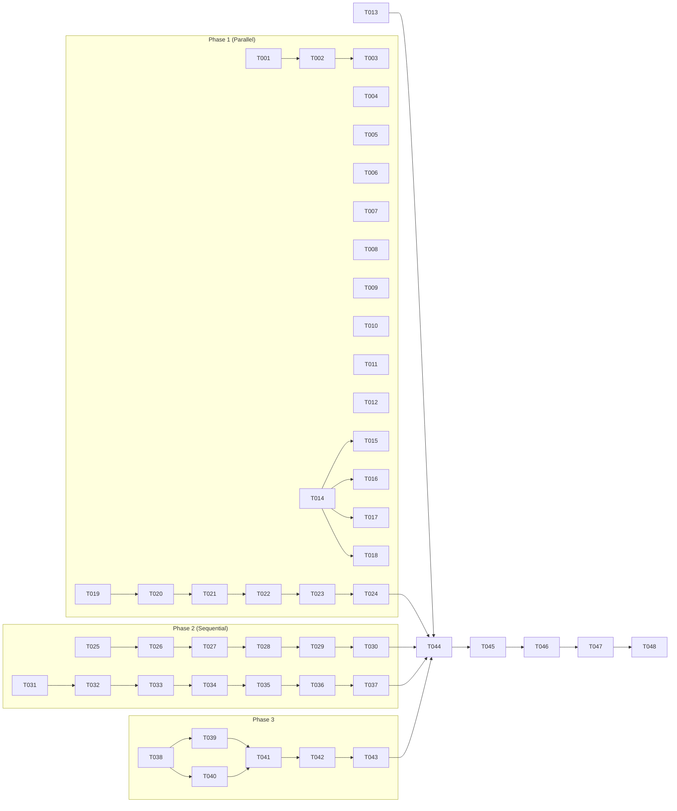

# Tasks: Frontend Code Quality & Performance Improvements (Phase 2)

**Input**: Design documents from `/specs/040-frontend-improvements-p2/`  
**Prerequisites**: plan.md ✓, spec.md ✓, research.md ✓, data-model.md ✓, quickstart.md ✓

**Tests**: Manual verification for UI changes, optional component tests.

**Organization**: Tasks grouped by user story for independent implementation.

**Status**: Draft

## Format: `[ID] [P?] [Story] Description`

- **[P]**: Can run in parallel (different files, no dependencies)
- **[Story]**: Which user story this task belongs to (US1-US6)
- Include exact file paths in descriptions

## Path Conventions

```
apps/web/src/
├── components/
│   ├── ui/
│   │   ├── NoCompanySelected.tsx  (NEW)
│   │   ├── input.tsx              (ENHANCE)
│   │   └── index.ts               (EXPORT)
│   ├── layout/
│   │   └── PageLayout.tsx         (CONSOLIDATE PageHeader)
│   └── forms/
│       └── OrderItemEditor.tsx    (NEW)
├── features/
│   ├── common/
│   │   └── components/
│   │       └── PartnerListPage.tsx (NEW)
│   ├── procurement/pages/
│   │   ├── Suppliers.tsx          (SIMPLIFY)
│   │   └── PurchaseOrders.tsx     (USE HOOK)
│   └── sales/pages/
│       ├── Customers.tsx          (SIMPLIFY)
│       └── SalesOrders.tsx        (USE HOOK)
└── hooks/
    └── useOrderForm.ts            (NEW)
```

---

## Phase 1: Quick Wins (No Dependencies)

**Purpose**: Immediate improvements with minimal risk

### User Story 3 - No Company Selected State (Priority: P3) ✅ Quick Win

**Goal**: Consistent empty state when no company is selected

**Independent Test**: Visit any feature page without company selected → see consistent NoCompanySelected component

- [ ] T001 [US3] Create `NoCompanySelected` component in `apps/web/src/components/ui/NoCompanySelected.tsx`
  - Props: message (optional), actionLabel (optional), actionHref (optional)
  - Display: Icon + message + optional Link to company selection
  - Style: Centered, gray text, primary link color
- [ ] T002 [US3] Export `NoCompanySelected` from `apps/web/src/components/ui/index.ts`
- [ ] T003 [P] [US3] Replace "Please select company" in `apps/web/src/features/procurement/pages/Suppliers.tsx`
- [ ] T004 [P] [US3] Replace "Please select company" in `apps/web/src/features/procurement/pages/PurchaseOrders.tsx`
- [ ] T005 [P] [US3] Replace "Please select company" in `apps/web/src/features/procurement/pages/PurchaseOrderDetail.tsx`
- [ ] T006 [P] [US3] Replace "Please select company" in `apps/web/src/features/sales/pages/Customers.tsx`
- [ ] T007 [P] [US3] Replace "Please select company" in `apps/web/src/features/sales/pages/SalesOrders.tsx`
- [ ] T008 [P] [US3] Replace "Please select company" in `apps/web/src/features/sales/pages/SalesOrderDetail.tsx`
- [ ] T009 [P] [US3] Replace "Please select company" in `apps/web/src/features/inventory/pages/Products.tsx`
- [ ] T010 [P] [US3] Replace "Please select company" in `apps/web/src/features/inventory/pages/Inventory.tsx`
- [ ] T011 [P] [US3] Replace "Please select company" in `apps/web/src/features/inventory/pages/GoodsReceipts.tsx`
- [ ] T012 [P] [US3] Replace "Please select company" in `apps/web/src/features/accounting/pages/Bills.tsx`
- [ ] T013 [P] [US3] Search for any remaining "Please select" patterns and replace

**Checkpoint**: All pages show consistent NoCompanySelected component

---

### User Story 4 - Consistent Form Inputs (Priority: P3) ✅ Quick Win

**Goal**: All form text inputs use shared Input component

**Independent Test**: Submit forms → verify Input component styling and behavior

- [ ] T014 [US4] Review and enhance `Input` component in `apps/web/src/components/ui/input.tsx`
  - Add props: helperText, containerClassName
  - Ensure error state styling is consistent
  - Ensure disabled state styling
- [ ] T015 [P] [US4] Replace raw inputs in `apps/web/src/features/procurement/pages/Suppliers.tsx` with shared Input
- [ ] T016 [P] [US4] Replace raw inputs in `apps/web/src/features/sales/pages/Customers.tsx` with shared Input
- [ ] T017 [P] [US4] Replace raw inputs in `apps/web/src/features/inventory/pages/Products.tsx` with shared Input
- [ ] T018 [P] [US4] Search for remaining raw `<input` elements and evaluate replacement

**Checkpoint**: Forms use shared Input component with consistent styling

---

### User Story 5 - Consolidated PageHeader (Priority: P3) ✅ Quick Win

**Goal**: Single PageHeader component for all pages

**Independent Test**: View list pages and detail pages → verify consistent header styling

- [ ] T019 [US5] Analyze both PageHeader components
  - `apps/web/src/components/ui/PageHeader.tsx` (detail pages)
  - `apps/web/src/components/layout/PageLayout.tsx` PageHeader export (list pages)
- [ ] T020 [US5] Create unified `PageHeader` interface supporting all props
  - title, subtitle, description, badges, actions, showBackButton, onBack
- [ ] T021 [US5] Consolidate into `apps/web/src/components/layout/PageHeader.tsx`
- [ ] T022 [US5] Remove `apps/web/src/components/ui/PageHeader.tsx`
- [ ] T023 [US5] Update imports in all detail pages using ui/PageHeader
- [ ] T024 [US5] Update `apps/web/src/components/ui/index.ts` to re-export from layout

**Checkpoint**: Single PageHeader used across all pages

---

## Phase 2: Page Consolidation

**Purpose**: Major code deduplication for partner and order pages

### User Story 1 - Consolidated Partner Pages (Priority: P2)

**Goal**: Single PartnerListPage component for Suppliers and Customers

**Independent Test**: CRUD operations work for both Suppliers and Customers

- [ ] T025 [US1] Create directory `apps/web/src/features/common/components/`
- [ ] T026 [US1] Create `PartnerListPage` component in `apps/web/src/features/common/components/PartnerListPage.tsx`
  - Props: type ('SUPPLIER' | 'CUSTOMER'), label, labelPlural, basePath
  - Include: list query, create modal, edit modal, delete confirmation
  - Use: usePartnerMutations hook, NoCompanySelected, LoadingState, EmptyState
- [ ] T027 [US1] Simplify `apps/web/src/features/procurement/pages/Suppliers.tsx`
  - Import PartnerListPage
  - Export thin wrapper: `<PartnerListPage type="SUPPLIER" label="Supplier" labelPlural="Suppliers" basePath="/suppliers" />`
- [ ] T028 [US1] Simplify `apps/web/src/features/sales/pages/Customers.tsx`
  - Import PartnerListPage
  - Export thin wrapper: `<PartnerListPage type="CUSTOMER" label="Customer" labelPlural="Customers" basePath="/customers" />`
- [ ] T029 [US1] Test all Supplier CRUD operations
- [ ] T030 [US1] Test all Customer CRUD operations

**Checkpoint**: Suppliers and Customers pages use shared PartnerListPage

---

### User Story 2 - Unified Order Form Logic (Priority: P2)

**Goal**: Shared useOrderForm hook for PO and SO creation

**Independent Test**: Create PO and SO with items → verify calculations match

- [ ] T031 [US2] Create `useOrderForm` hook in `apps/web/src/hooks/useOrderForm.ts`
  - State: items[], currentItem
  - Actions: setCurrentItem, addItem, removeItem, resetForm
  - Computed: totals (subtotal, taxAmount, total)
  - Use useMemo for totals, useCallback for actions
- [ ] T032 [US2] Create `OrderItemEditor` component in `apps/web/src/components/forms/OrderItemEditor.tsx`
  - Props: products, currentItem, onCurrentItemChange, onAddItem
  - Render: product select, quantity input, unit price input, notes input, add button
- [ ] T033 [US2] Update `apps/web/src/features/procurement/pages/PurchaseOrders.tsx`
  - Import and use useOrderForm hook
  - Replace inline item state and handlers
  - Use OrderItemEditor for item form
- [ ] T034 [US2] Update `apps/web/src/features/sales/pages/SalesOrders.tsx`
  - Import and use useOrderForm hook
  - Replace inline item state and handlers
  - Use OrderItemEditor for item form
- [ ] T035 [US2] Test PO creation with multiple items
- [ ] T036 [US2] Test SO creation with multiple items
- [ ] T037 [US2] Verify totals calculation matches in both

**Checkpoint**: PO and SO forms use shared useOrderForm hook

---

## Phase 3: Performance Optimization

**Purpose**: Improve render performance for large lists

### User Story 6 - Performance Memoization (Priority: P4)

**Goal**: Memoize expensive renders and calculations

**Independent Test**: Profile before/after with React DevTools

- [ ] T038 [US6] Profile app with React DevTools to identify slow components
- [ ] T039 [P] [US6] Add React.memo to `apps/web/src/components/ui/OrderListTable.tsx` row component
- [ ] T040 [P] [US6] Add React.memo to `apps/web/src/components/ui/OrderItemsTable.tsx` row component
- [ ] T041 [US6] Add useCallback for handlers in PartnerListPage (if created in US1)
- [ ] T042 [US6] Add useMemo for filtered lists where applicable
- [ ] T043 [US6] Profile again and document improvement

**Checkpoint**: Measurable render performance improvement

---

## Phase 4: Verification & Polish

**Purpose**: Final verification and cleanup

- [ ] T044 Run `npm run typecheck` - verify no TypeScript errors
- [ ] T045 Run `npm run build` - verify build succeeds
- [ ] T046 Manual test all affected features (partners, orders, forms)
- [ ] T047 Update `docs/frontend-improvements.md` to reflect completed items
- [ ] T048 Stage all changes: `git add apps/web/src/ specs/040-frontend-improvements-p2/`

---

## Summary Table

| Phase | Tasks | Files Created | Files Modified | Parallel Opportunities |
|-------|-------|---------------|----------------|----------------------|
| Phase 1 (Quick Wins) | T001-T024 | 1 | 12+ | T003-T013 (NoCompany), T015-T018 (Input) |
| Phase 2 (Consolidation) | T025-T037 | 3 | 4 | - |
| Phase 3 (Performance) | T038-T043 | 0 | 3+ | T039-T040 |
| Phase 4 (Verification) | T044-T048 | 0 | 1 | - |
| **Total** | **48** | **4** | **20+** | **High parallelism in Phase 1** |

---

## Dependencies


