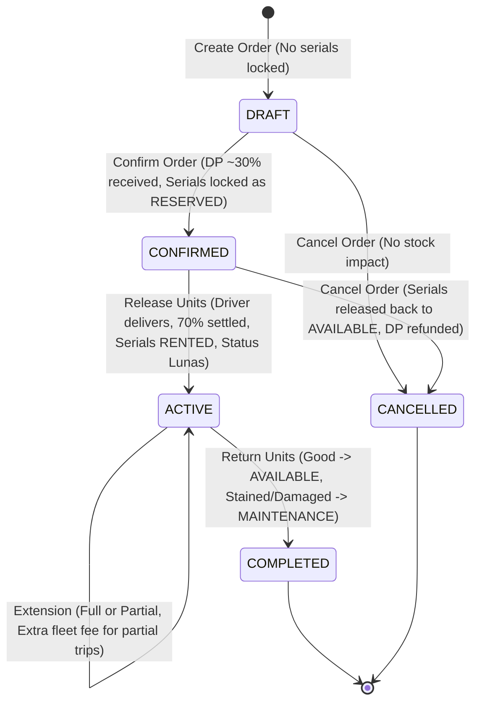
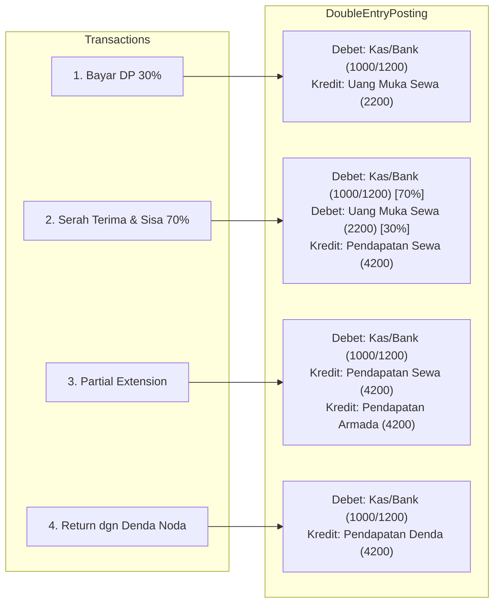

# Data Model: Rental Flow Alignment (Feature 045)

## 1. Entity Definitions & Lifecycle States

### RentalOrder
The root document representing a customer rental contract from WhatsApp booking to physical mattress return.

#### Field Specifications
| Field | Type | Required | Description |
|-------|------|----------|-------------|
| `id` | UUID | Yes | Primary key |
| `companyId` | UUID | Yes | Multi-tenant isolation scope |
| `partnerId` | UUID | Yes | Customer reference |
| `orderNumber` | String | Yes | Unique human-readable document number (e.g. `RO-2026-0001`) |
| `rentalStartDate` | DateTime | Yes | Start of rental service |
| `rentalEndDate` | DateTime | Yes | End of base rental period |
| `dueDateTime` | DateTime | Yes | Return deadline |
| `status` | RentalOrderStatus | Yes | `DRAFT` \| `CONFIRMED` \| `ACTIVE` \| `COMPLETED` \| `CANCELLED` |
| `rentalPaymentStatus` | RentalPaymentStatus | Yes | `PENDING` \| `AWAITING_CONFIRM` \| `CONFIRMED` (Lunas) \| `FAILED` |
| `subtotal` | Decimal(15,2) | Yes | Subtotal rental charges |
| `depositAmount` | Decimal(15,2) | Yes | Down payment (DP) amount paid by customer |
| `deliveryFee` | Decimal(15,2) | No | Initial delivery logistics fee |
| `totalAmount` | Decimal(15,2) | Yes | Subtotal + deliveryFee - discounts |
| `paymentMethod` | String | No | Payment method (`CASH`, `BANK`, `QRIS`) |
| `paymentConfirmedAt` | DateTime | No | Timestamp when final 70% settlement was confirmed |

---

### RentalItemUnit
Individual physical mattress asset tracked by physical serial number/barcode.

| Field | Type | Description |
|-------|------|-------------|
| `id` | UUID | Primary key |
| `rentalItemId` | UUID | Product catalogue grouping reference |
| `unitCode` | String | Unique serial barcode (e.g. `KSR-120-004`) |
| `status` | UnitStatus | `AVAILABLE`, `RESERVED`, `RENTED`, `MAINTENANCE`, `RETIRED` |
| `condition` | UnitCondition | `NEW`, `GOOD`, `FAIR`, `NEEDS_REPAIR` |

#### Transition Rules
- **At Booking (`DRAFT`)**: No unit assigned.
- **At Confirmation (`CONFIRMED`)**: Units selected/auto-assigned -> status changed from `AVAILABLE` to `RESERVED`.
- **At Release (`ACTIVE`)**: Units handed over to customer -> status changed from `RESERVED` to `RENTED`.
- **At Return (`COMPLETED`)**:
  - If unit condition is `GOOD` or `NEW` without damage: Status changed directly to `AVAILABLE`.
  - If unit condition is `FAIR`, `NEEDS_REPAIR`, or has stains/damage severity: Status changed to `MAINTENANCE`.
- **At Cancellation (`CANCELLED`)**: Units released from `RESERVED` back to `AVAILABLE`.

---

### RentalOrderExtension
Log of term extensions requested during an active rental.

| Field | Type | Description |
|-------|------|-------------|
| `id` | UUID | Primary key |
| `rentalOrderId` | UUID | Parent rental order |
| `extensionNumber` | Integer | Sequence index (1, 2, 3...) |
| `previousEndDate` | DateTime | Previous expiration timestamp |
| `newEndDate` | DateTime | New extended expiration timestamp |
| `additionalDays` | Integer | Extra days added |
| `additionalAmount` | Decimal(15,2) | Additional mattress rental revenue |
| `deliveryFee` | Decimal(15,2) | Extra fleet logistics fee for partial pickup trips |
| `deliveryFeeLabel` | String | Label (e.g. "Biaya Tambahan Armada") |
| `isPaid` | Boolean | True when payment received |
| `paidAt` | DateTime | Payment timestamp |

---

### ItemConditionLog
Inspection audit trail recorded during serah terima (Release) and penjemputan (Return).

| Field | Type | Description |
|-------|------|-------------|
| `id` | UUID | Primary key |
| `rentalItemUnitId` | UUID | Physical unit inspected |
| `rentalOrderId` | UUID | Order reference |
| `conditionType` | ConditionType | `RELEASE` (Serah Terima) \| `RETURN` (Pengembalian) |
| `condition` | UnitCondition | Assessed grade (`GOOD`, `FAIR`, etc.) |
| `damageSeverity` | DamageSeverity? | `MINOR`, `MAJOR`, `UNUSABLE`, or null |
| `beforePhotos` | String[] | URLs / base64 of handover condition photos |
| `afterPhotos` | String[] | URLs / base64 of return condition photos |
| `notes` | String? | Inspector/driver comments (e.g. "Noda tumpahan sirup") |
| `assessedBy` | UUID | User ID of staff/driver recording log |

---

## 2. Double-Entry Accounting Schemas

### JournalEntry & Lines Mapping

