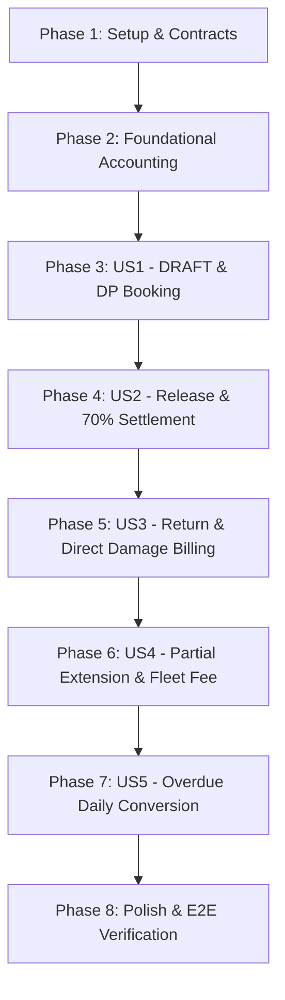

# Tasks: Alur Operasional Rental Riil (Rental Flow Alignment)

**Feature**: `045-rental-flow-alignment` | **Spec**: [specs/045-rental-flow-alignment/spec.md](spec.md) | **Plan**: [specs/045-rental-flow-alignment/plan.md](plan.md)

---

## Phase 1: Setup (Shared Contracts & In-Place Validators)

**Purpose**: Update canonical Zod validation schemas in-place in `@sync-erp/shared` without creating duplicate schemas, maintaining single source of truth.

- [ ] T001 [P] Update canonical schemas `ConfirmRentalOrderSchema`, `ManualConfirmRentalOrderSchema`, `ReleaseRentalOrderSchema`, `ExtendRentalOrderSchema`, `ProcessReturnSchema`, and `CancelRentalOrderSchema` in packages/shared/src/validators/rental.ts with JSDoc documenting depositAmount as Down Payment
- [ ] T002 Re-export updated schemas and inferred TypeScript types in packages/shared/src/validators/index.ts
- [ ] T003 Build packages/shared package with npm run build in packages/shared/

---

## Phase 2: Foundational (Accounting Journal Automation)

**Purpose**: Implement automatic double-entry accounting procedures for rental transactions (`JournalRentalService`) with strict `Decimal.js` precision.

**⚠️ CRITICAL**: Blocking prerequisite for all financial user stories.

- [ ] T004 Implement `postRentalDownPayment` in apps/api/src/modules/accounting/services/journal-rental.service.ts (Debet Kas/Bank, Kredit Uang Muka Sewa '2200' using Decimal.js)
- [ ] T005 [P] Implement `postRentalReleaseSettlement` in apps/api/src/modules/accounting/services/journal-rental.service.ts (Debet Kas/Bank sisa 70%, Debet Uang Muka '2200', Kredit Pendapatan Sewa '4200' dan Ongkir '4200' using Decimal.js)
- [ ] T006 [P] Implement `postRentalExtension` in apps/api/src/modules/accounting/services/journal-rental.service.ts (Debet Kas/Bank, Kredit Pendapatan Sewa '4200' dan Biaya Armada Ekstra using Decimal.js)
- [ ] T007 [P] Implement `postRentalDamageFee` in apps/api/src/modules/accounting/services/journal-rental.service.ts (Debet Kas/Bank, Kredit Pendapatan Denda '4200' using Decimal.js)
- [ ] T008 [P] Implement `postRentalCancellationRefund` in apps/api/src/modules/accounting/services/journal-rental.service.ts (Debet Uang Muka '2200', Kredit Kas/Bank using Decimal.js)
- [ ] T009 Expose and delegate rental journal methods in apps/api/src/modules/accounting/services/journal.service.ts
- [ ] T010 Add unit tests verifying balanced dual-entry journals in apps/api/test/modules/accounting/journal-rental.service.spec.ts

**Checkpoint**: Accounting foundation ready - financial transactions can now be recorded cleanly across all user stories.

---

## Phase 3: User Story 1 - Pembuatan Draft Order & Penguncian Stok via DP (Priority: P1) 🎯 MVP

**Goal**: Enable creating booking orders in `DRAFT` without locking serials, locking physical serials (`RESERVED`) upon DP receipt with automatic journal posting, and providing fallback for stock shortages & cancellation.

**Independent Test**: Create order in UI without serials (status `DRAFT`), confirm order with DP Rp 100.000, verify units become `RESERVED` and journal `Rental DP: {orderNumber}` is posted to general ledger.

### Implementation for User Story 1

- [ ] T011 [US1] Update `confirmOrder` in apps/api/src/modules/rental/rental-order-fulfillment.service.ts to accept DP payment input, assign units as `RESERVED`, and call `postRentalDownPayment`
- [ ] T012 [US1] Ensure `createOrder` in apps/api/src/modules/rental/rental-order-lifecycle.service.ts creates orders in `DRAFT` with no unit assignments locked
- [ ] T013 [US1] Update `confirm` mutation input validation in apps/api/src/trpc/routers/rental.router.ts
- [ ] T014 [US1] Update `ConfirmOrderModal.tsx` in apps/web/src/features/rental/modals/ConfirmOrderModal.tsx to include DP nominal input, payment method selection, and destination Kas/Bank account
- [ ] T015 [US1] Update `CreateOrderModal.tsx` in apps/web/src/features/rental/modals/CreateOrderModal.tsx to omit physical serial selection during initial draft creation
- [ ] T016 [US1] Implement stock shortage fallback in apps/web/src/features/rental/modals/ConfirmOrderModal.tsx and apps/api/src/modules/rental/rental-order-fulfillment.service.ts allowing stock conversion or manual confirmation with audit reason per FR-004
- [ ] T017 [US1] Implement cancellation & refund orchestration in apps/api/src/modules/rental/rental-order-lifecycle.service.ts (`cancelOrder`) and apps/web/src/features/rental/modals/CancelOrderModal.tsx to release `RESERVED` units and invoke `postRentalCancellationRefund` per FR-015 and FR-020

**Checkpoint**: At this point, User Story 1 is fully functional and independently testable as the MVP.

---

## Phase 4: User Story 2 - Serah Terima Unit di Lokasi & Pelunasan 70% (Priority: P1)

**Goal**: Record delivery serah terima, collect remaining 70% payment atomically, set order to `ACTIVE`, set payment status to `CONFIRMED` (Lunas), and post revenue journal.

**Independent Test**: Open `CONFIRMED` order, click "Release Units", record Rp 200.000 settlement payment, submit. Verify order is `ACTIVE`, payment is `Lunas`, units are `RENTED`, and revenue journal is posted.

### Implementation for User Story 2

- [ ] T018 [US2] Update `releaseOrder` in apps/api/src/modules/rental/rental-order-fulfillment.service.ts to process integrated 70% settlement payment, update `rentalPaymentStatus` to `CONFIRMED`, and post `postRentalReleaseSettlement` journal
- [ ] T019 [US2] Update `release` procedure in apps/api/src/trpc/routers/rental.router.ts to accept `payment` schema
- [ ] T020 [US2] Update `UnitAssignmentModal.tsx` in apps/web/src/features/rental/modals/UnitAssignmentModal.tsx to add payment collection inputs (settlement amount, payment method, Kas/Bank account)
- [ ] T021 [US2] Update `RentalPaymentStatusCard.tsx` in apps/web/src/features/rental/components/RentalPaymentStatusCard.tsx to display `Lunas` chip when `rentalPaymentStatus === 'CONFIRMED'`
- [ ] T022 [US2] Update status indicators in apps/web/src/features/rental/pages/RentalOrderDetail.tsx and orders list to prevent displaying "Belum Bayar" on fully paid orders

**Checkpoint**: User Story 1 AND User Story 2 are both functional and independently testable.

---

## Phase 5: User Story 3 - Pengembalian Unit & Tagihan Kerusakan Tanpa Deposit (Priority: P1)

**Goal**: Inspect units on return; immediately route good units to `AVAILABLE` and dirty/damaged units to `MAINTENANCE`; bill damage/cleaning fees on the spot without pseudo deposit deduction.

**Independent Test**: Return an active order with 2 units: 1 unit `GOOD` (becomes `AVAILABLE`), 1 unit `FAIR` with stain notes (becomes `MAINTENANCE`), pay Rp 50.000 cleaning fee, order becomes `COMPLETED`, damage journal is posted.

### Implementation for User Story 3

- [ ] T023 [US3] Update `processReturn` in apps/api/src/modules/rental/rental-return.service.ts to route clean units directly to `UnitStatus.AVAILABLE` and damaged units to `UnitStatus.MAINTENANCE`
- [ ] T024 [US3] Add direct damage payment recording and dispatch `postRentalDamageFee` journal in apps/api/src/modules/rental/rental-return.service.ts
- [ ] T025 [US3] Update `RentalPolicy.ensureCanReturn` and return validation in apps/api/src/modules/rental/rental.policy.ts to complete order directly without requiring pseudo deposit finalization
- [ ] T026 [US3] Update `returns.process` procedure in apps/api/src/trpc/routers/rental.router.ts to accept damage payment input
- [ ] T027 [US3] Update `ReturnModal.tsx` in apps/web/src/features/rental/modals/ReturnModal.tsx to show clean/damage unit condition checkboxes, on-the-spot fee input, and remove obsolete deposit deduction fields

**Checkpoint**: Complete primary 3-phase lifecycle (Booking → Handover → Return) is operational.

---

## Phase 6: User Story 4 - Fleksibilitas Perpanjangan: Full vs Partial Extension (Priority: P2)

**Goal**: Support extending individual units (Partial Extension) with extra fleet trip fee (`deliveryFee`) and post extension revenue journal.

**Independent Test**: On order with 3 units, extend 1 unit by 2 days, add Rp 25.000 extra fleet fee, submit. Verify Unit 1 return date is extended while other 2 units remain unchanged, and extension journal is posted.

### Implementation for User Story 4

- [ ] T028 [US4] Update `extendOrder` in apps/api/src/modules/rental/rental-order-lifecycle.service.ts to support unit-specific extensions, store `deliveryFee` with label "Biaya Tambahan Armada", and post `postRentalExtension` journal
- [ ] T029 [US4] Update `orders.extend` procedure in apps/api/src/trpc/routers/rental.router.ts
- [ ] T030 [US4] Update `RentalExtensionsCard.tsx` in apps/web/src/features/rental/components/RentalExtensionsCard.tsx to display per-unit extension details and extra fleet fee badge
- [ ] T031 [US4] Add modal/form controls for Partial Extension with unit selection checkboxes and extra fleet fee field in apps/web/src/features/rental/modals/RentalExtensionModal.tsx

**Checkpoint**: Perpanjangan penuh dan sebagian berfungsi secara independen.

---

## Phase 7: User Story 5 - Penanganan Overdue Menjadi Sewa Harian Otomatis (Priority: P3)

**Goal**: Convert delayed pickup / overdue days into proportional daily rental extensions and provide a ready-to-send customer WhatsApp message template.

**Independent Test**: On an overdue order, trigger "Konversi Sewa Harian", verify extension record is generated with proportional daily rate and WhatsApp copy modal is displayed.

### Implementation for User Story 5

- [ ] T032 [US5] Add `convertOverdueToExtension` helper in apps/api/src/modules/rental/rental-order-lifecycle.service.ts to calculate overdue days and create extension
- [ ] T033 [US5] Expose `orders.convertOverdue` procedure in apps/api/src/trpc/routers/rental.router.ts
- [ ] T034 [US5] Add "Konversi Sewa Harian" button in apps/web/src/features/rental/components/RentalActionsCard.tsx with WhatsApp notification text generator modal

**Checkpoint**: All 5 user stories are complete and operational.

---

## Phase 8: Polish & Cross-Cutting Concerns

**Purpose**: Project-wide verification, strict type checking, end-to-end integration test per Constitution XVII, and quickstart validation.

- [ ] T035 [P] Implement end-to-end integration test in apps/api/test/modules/rental/rental-flow-lifecycle.e2e.spec.ts covering sequential business flow (DRAFT -> CONFIRMED with DP -> ACTIVE with 70% settlement -> COMPLETED with return/damage) in a single test block per Constitution Rule XVII.2
- [ ] T036 Run strict TypeScript typechecking and linter with npm run lint across monorepo
- [ ] T037 Run Vitest automated test suite with npm test
- [ ] T038 [P] Verify quickstart validation scenarios in specs/045-rental-flow-alignment/quickstart.md
- [ ] T039 Update documentation and remove obsolete references to pseudo security deposits in docs/

---

## Dependencies & Execution Order

### Phase Dependencies

### Parallel Opportunities

- **Phase 1**: `T001` and `T002` can be edited concurrently before `T003` build.
- **Phase 2**: `T005`, `T006`, `T007`, `T008` (journal methods) can be implemented in parallel.
- **Across Stories**:
  - UI components (e.g. `T014`, `T018`, `T027`, `T030`) can be developed concurrently with service tests once Phase 1 schemas are compiled.

---

## Implementation Strategy

### MVP First (User Story 1 & User Story 2)
1. Complete Phase 1 (Contracts & Shared build).
2. Complete Phase 2 (Foundational Accounting journals).
3. Complete Phase 3 (US1: Draft + DP Confirmation + Fallback + Cancel).
4. Complete Phase 4 (US2: Release + 70% Settlement).
5. **Validate MVP**: At this stage, the business can take bookings, receive DP, deliver beds, and collect the 70% balance with 100% accurate financial journals.

### Incremental Delivery
1. Foundation & MVP (Phase 1-4) → Tested & Verified.
2. Return & Damaged Unit Routing (Phase 5) → Eliminates deposit friction on closeout.
3. Extension & Overdue (Phase 6-7) → Adds operational flexibility for groups and delays.
4. Polish & Mandatory E2E Test (Phase 8) → Code quality, lint, E2E sequential test, and test suite green.
